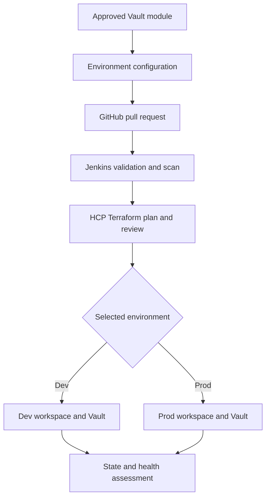
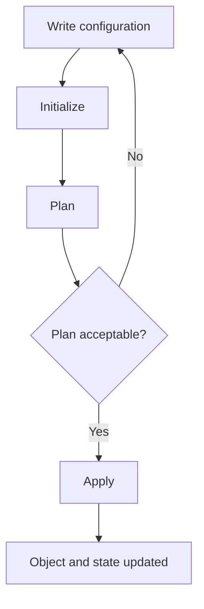
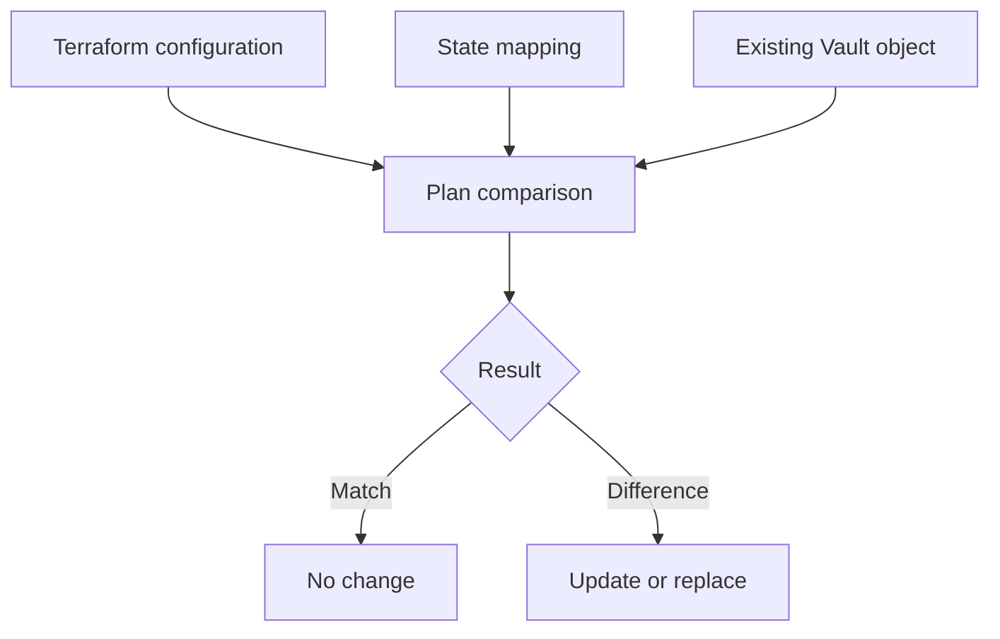
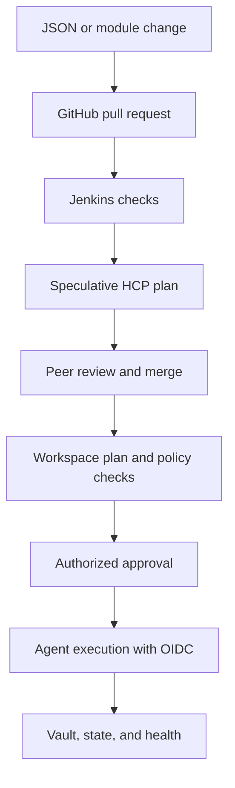

# Nutanix Terraform and Vault Enablement

<!-- markdownlint-disable MD013 MD024 -->

Trainer runbook for a three-session HCP Terraform and Vault enablement series.

## How to use this guide

This guide is written for a trainer with limited Terraform and Vault experience.
It tells you what to define, what to demonstrate, what attendees should practice,
and how to check their understanding.

Do not attempt a lab for the first time in front of the customer. Complete every
walkthrough twice, save screenshots of the successful result, and keep the
screenshots open as a backup during delivery.

The continuous pilot is intentionally small:

> Use reusable Terraform code and non-sensitive JSON input to manage one team
> configuration in the development Vault cluster through a reviewed and
> approval-controlled HCP Terraform workflow.

Do not begin by importing all 60-65 existing Vault namespaces.

## Confirmed customer baseline

- The team already uses HCP Terraform workspaces and HCP-managed state.
- Terraform code is stored and peer-reviewed in GitHub.
- Most runs are currently started from the Terraform CLI.
- The team wants to move toward VCS-driven HCP Terraform runs.
- CI is moving from CircleCI to Jenkins.
- Vault Enterprise has separate development and production clusters.
- Vault contains approximately 60-65 team namespaces.
- Current Vault automation uses Python libraries and manual operations.
- The requested Vault resources are not currently managed in Terraform state.
- The team has mixed foundational and intermediate Terraform experience.
- Development and production are not identical. A team may exist in
  development, production, or both.
- The first goal is consistent Vault automation. Wider Terraform governance is
  a later workstream.

## Training outcomes

By the end of the three sessions, attendees should be able to:

1. Explain configuration, providers, resources, data sources, plans, applies,
   state, modules, imports, and moved blocks.
2. Build a small reusable Vault module driven by non-sensitive JSON input.
3. Import one existing Vault resource and reconcile the first plan safely.
4. Explain appropriate workspace and state boundaries.
5. Explain the target GitHub, Jenkins, and HCP Terraform workflow.
6. Distinguish Agent connectivity from OIDC authentication.
7. Place static scans, run tasks, policy checks, Vault EGP, and drift detection
   in the correct control layers.
8. Explain the shared governance model based on approved modules, policies,
   RBAC, and delegated team ownership.

## What is and is not included

### Included

- Terraform and HCP Terraform baseline review
- Vault provider fundamentals
- Modules, JSON input, loops, conditions, validation, and templates
- CLI import, import blocks, generated configuration, data sources, and moved
  blocks
- Workspace and state design
- GitHub, Jenkins, and VCS-driven HCP Terraform runs
- HCP Terraform Agents and Vault OIDC dynamic credentials
- Security scanning, policies, approvals, and drift detection
- Private registry, RBAC, delegated governance, and Infragraph overview

### Not included in the initial pilot

- Production changes
- Bulk import of all existing Vault resources
- Vault installation, upgrade, DR, or performance replication
- Full Okta identity mapping
- Full EGP or RGP redesign
- Scanner procurement or a full scanner comparison
- Scheduled cleanup or inactive-entity deletion
- Emergency bulk actions
- Upgrade testing or one-time data migration orchestration

Terraform should manage desired state. Scheduled cleanup, runtime decisions,
testing, and emergency operations belong in separately governed scripts,
Jenkins jobs, or Vault API workflows.

## Program structure

This version reduces the program from five 60-minute sessions to three
90-minute sessions. Each session uses the same learning structure.

| Session | Topic | Definition | Trainer walkthrough | Attendee practice | Quiz and close |
| --- | --- | ---: | ---: | ---: | ---: |
| 1 | Foundations and reusable Vault configuration | 20 min | 30 min | 30 min | 10 min |
| 2 | Import, refactoring, workspace, and state design | 20 min | 30 min | 30 min | 10 min |
| 3 | VCS workflow, security, drift, and governance | 20 min | 30 min | 30 min | 10 min |

If only 60 minutes is available, keep the definition and trainer walkthrough in
the live session. Assign practice and the quiz as follow-up work. Do not rush an
import or production-connected demonstration.

## Target pattern

The same approved module can be used with separate environment configuration,
workspaces, state, and approvals. Development is not a mandatory gateway to
production because the customer environments are not identical.



## Prerequisites

### Customer prerequisites

Confirm these at least five business days before the first live lab:

- [ ] One development Vault pilot team or namespace
- [ ] Exact Vault resources included in the pilot
- [ ] HCP Terraform organization and project names
- [ ] Pilot GitHub repository
- [ ] Jenkins runner with Terraform and the chosen IaC scanner
- [ ] Development Vault address and CA chain
- [ ] HCP Terraform Agent pool with network access to development Vault
- [ ] Vault administrator available for the security discussion
- [ ] Approved Vault role and least-privilege policy design
- [ ] Module owner, backup owner, and development approver
- [ ] Confirmation that JSON and Git will contain no secrets

If the customer environment is not ready, use the disposable local lab and the
prepared HCP Terraform screenshots. Do not troubleshoot customer networking or
identity live.

### Trainer prerequisites

- [ ] Install Terraform CLI 1.5 or later.
- [ ] Install Git, Vault CLI, and Docker.
- [ ] Complete every lab in this guide twice.
- [ ] Save screenshots of each successful step.
- [ ] Prepare a clean lab directory before each session.
- [ ] Rehearse each definition in plain language.
- [ ] Ask a Vault specialist to review Enterprise namespace and OIDC content.
- [ ] Never use a production Vault token or production workspace in training.

## Trainer glossary

| Term | Plain-language definition |
| --- | --- |
| Configuration | Terraform files that describe the intended result. |
| Provider | The plugin Terraform uses to call an API, such as Vault. |
| Resource | An object Terraform creates or manages. |
| Data source | Read-only information queried from an API. It does not manage the object. |
| State | Terraform's record mapping resource addresses to real objects. |
| Plan | A preview of proposed changes. |
| Apply | Execution of an approved plan. |
| Module | Reusable Terraform configuration with defined inputs and outputs. |
| Import | Connects an existing object to a resource address in state. |
| Moved block | Changes a resource address without recreating the object. |
| Workspace | An HCP Terraform execution and state boundary. |
| Project | An HCP Terraform grouping and access boundary. |
| Agent | Executes HCP Terraform runs inside a private network. |
| OIDC dynamic credentials | Short-lived identity used by a run to authenticate. |
| Run task | An external integration called during an HCP Terraform run. |
| Health assessment | HCP Terraform checks for drift and continuous validation. |

## Session 1: Foundations and reusable Vault configuration

### Session objective

Attendees will understand the Terraform lifecycle and build a small Vault
module that reads non-sensitive team configuration from JSON.

### Part 1: Definition - 20 minutes

#### What to say

> Terraform configuration defines the desired result. A provider lets
> Terraform call an API. Resources are objects Terraform manages. State records
> which real objects belong to which Terraform resource addresses. A plan
> previews the difference, and an apply performs an approved change.

Draw or show this lifecycle:



Explain these four points:

1. Configuration is the intended result. State is Terraform's tracking record.
2. A resource manages an object. A data source only reads information.
3. A module packages a repeated pattern. It does not contain or discover state.
4. HCP Terraform adds managed execution, state, VCS integration, RBAC,
   policies, approvals, run history, and health assessments.

#### Terraform Community and HCP Terraform

| Capability | Terraform Community | HCP Terraform |
| --- | --- | --- |
| Terraform language and CLI | Included | Included |
| Shared remote execution | Requires external setup | Built in |
| Managed state and locking | Requires a backend | Built in |
| VCS-triggered runs | Requires external automation | Built in |
| Team RBAC and approvals | External | Built in by edition |
| Private registry and policies | External | Built in by edition |
| Health assessments | Not included | Available by edition |

#### Module design for this pilot

Use this separation:

| Location | Contains | Must not contain |
| --- | --- | --- |
| Reusable module | Resource pattern, validation, defaults, outputs | Customer secrets or environment ownership data |
| JSON input | Team name and approved non-sensitive options | Tokens, passwords, private keys, secret values |
| Workspace | Environment-specific execution, variables, state, access | Unrelated teams with a different lifecycle |

### Part 2: Hands-on walkthrough - 30 minutes

The trainer performs every step while attendees watch and ask questions.

#### Walkthrough A: Start a disposable Vault server

Use a customer-approved Vault version. The tag below is only a training
example.

```bash
docker run --rm \
  --cap-add=IPC_LOCK \
  --name vault-training \
  -e VAULT_DEV_ROOT_TOKEN_ID=training-root \
  -e VAULT_DEV_LISTEN_ADDRESS=0.0.0.0:8200 \
  -p 8200:8200 \
  hashicorp/vault:1.21.4
```

Open a second terminal:

```bash
export VAULT_ADDR=http://127.0.0.1:8200
export VAULT_TOKEN=training-root
vault status
```

Expected result: Vault is initialized, unsealed, and running in development
mode. This root token is acceptable only for the disposable local lab.

#### Walkthrough B: Create the repository structure

```text
vault-team-training/
|-- main.tf
|-- outputs.tf
|-- teams.json
|-- versions.tf
`-- modules/
    `-- team-config/
        |-- main.tf
        |-- outputs.tf
        |-- variables.tf
        `-- templates/
            `-- reader-policy.hcl.tftpl
```

Create the directories:

```bash
mkdir -p vault-team-training/modules/team-config/templates
cd vault-team-training
```

#### Walkthrough C: Create the root configuration

Create `versions.tf`:

```hcl
terraform {
  required_version = ">= 1.5.0"

  required_providers {
    vault = {
      source  = "hashicorp/vault"
      version = "~> 5.0"
    }
  }
}

provider "vault" {}
```

The provider reads `VAULT_ADDR` and `VAULT_TOKEN` from the local environment.
This is not the HCP Terraform production authentication design.

Create `teams.json`:

```json
{
  "teams": {
    "payments": {
      "enable_kv": true
    }
  }
}
```

Create root `main.tf`:

```hcl
locals {
  team_configuration = jsondecode(file("${path.module}/teams.json"))
  teams              = local.team_configuration.teams
}

module "team_config" {
  source   = "./modules/team-config"
  for_each = local.teams

  team_name = each.key
  enable_kv = try(each.value.enable_kv, true)
}
```

Create root `outputs.tf`:

```hcl
output "team_mounts" {
  description = "KV mount created for each configured team."
  value = {
    for team_name, team_module in module.team_config :
    team_name => team_module.mount_path
  }
}
```

#### Walkthrough D: Create the reusable child module

Create `modules/team-config/variables.tf`:

```hcl
variable "team_name" {
  description = "Short lowercase team identifier."
  type        = string

  validation {
    condition     = can(regex("^[a-z][a-z0-9-]{2,30}$", var.team_name))
    error_message = "Use 3-31 lowercase letters, numbers, or hyphens."
  }
}

variable "enable_kv" {
  description = "Whether to create the team's KV v2 secrets engine."
  type        = bool
  default     = true
}
```

Create `modules/team-config/templates/reader-policy.hcl.tftpl`:

```hcl
path "${mount_path}/data/*" {
  capabilities = ["read", "list"]
}

path "${mount_path}/metadata/*" {
  capabilities = ["read", "list"]
}
```

Create `modules/team-config/main.tf`:

```hcl
terraform {
  required_providers {
    vault = {
      source = "hashicorp/vault"
    }
  }
}

locals {
  mount_path = "${var.team_name}-kv"
}

resource "vault_mount" "team_kv" {
  count = var.enable_kv ? 1 : 0

  path        = local.mount_path
  type        = "kv"
  description = "KV v2 engine for ${var.team_name}"

  options = {
    version = "2"
  }
}

resource "vault_policy" "team_reader" {
  count = var.enable_kv ? 1 : 0

  name = "${var.team_name}-reader"
  policy = templatefile(
    "${path.module}/templates/reader-policy.hcl.tftpl",
    { mount_path = local.mount_path }
  )
}
```

Create `modules/team-config/outputs.tf`:

```hcl
output "mount_path" {
  description = "Created KV mount path, or null when disabled."
  value       = var.enable_kv ? vault_mount.team_kv[0].path : null
}
```

#### Walkthrough E: Run and explain the plan

```bash
terraform init
terraform fmt -recursive
terraform validate
terraform plan -out=tfplan
terraform apply tfplan
terraform state list
vault secrets list
vault policy read payments-reader
```

Expected state addresses:

```text
module.team_config["payments"].vault_mount.team_kv[0]
module.team_config["payments"].vault_policy.team_reader[0]
```

Point to each address and explain the module instance, resource type, resource
name, and conditional index.

#### Enterprise namespace extension

The disposable Vault server cannot create Enterprise namespaces. In the
customer development environment, a reviewed module can use a pattern similar
to this:

```hcl
resource "vault_namespace" "team" {
  namespace = var.parent_namespace
  path      = var.team_name
}

resource "vault_mount" "team_kv" {
  namespace = vault_namespace.team.path_fq
  path      = "kv"
  type      = "kv"

  options = {
    version = "2"
  }
}
```

Do not copy this small example into production. The final module must account
for the customer's namespace hierarchy, EGP restrictions, identity mappings,
auth methods, quotas, and ownership rules.

### Part 3: Hands-on practice - 30 minutes

Attendees work in pairs. The trainer observes and helps only after a pair has
read the error and described what it means.

#### Practice task 1: Add a second team

Update `teams.json`:

```json
{
  "teams": {
    "analytics": {
      "enable_kv": true
    },
    "payments": {
      "enable_kv": true
    }
  }
}
```

Run:

```bash
terraform fmt -recursive
terraform validate
terraform plan
```

Before applying, each pair must state:

- Which module instance will be added
- Which Vault resources will be added
- Why the existing `payments` resources remain unchanged

Apply only after the explanation is correct:

```bash
terraform apply
terraform state list
```

#### Practice task 2: Test a condition

Change `analytics.enable_kv` to `false` and run `terraform plan`.

Expected result: the analytics Vault resources are proposed for deletion if
they were already applied. This demonstrates why an innocent-looking JSON
change can be destructive and requires review.

Restore the value to `true` before the next task.

#### Practice task 3: Trigger input validation

Rename `analytics` to `Analytics Team` and run:

```bash
terraform plan
```

Expected result: the input validation rejects the name. Restore `analytics`.

#### Practice completion check

- [ ] Both team module instances appear in the plan or state.
- [ ] Attendees can explain `for_each` and `count` in this example.
- [ ] Attendees saw validation reject an invalid team name.
- [ ] No secret value was added to JSON.

### Part 4: Quiz - 10 minutes

Ask attendees to answer without consulting the guide.

1. What does Terraform state record?
   - A. Only the latest plan
   - B. Mappings between Terraform addresses and real objects
   - C. Vault audit logs
   - D. Git pull requests
2. What does a data source do?
   - A. Reads existing information
   - B. Imports an object into state
   - C. Approves an apply
   - D. Stores credentials
3. What should be stored in `teams.json`?
   - A. Vault root tokens
   - B. Private keys
   - C. Non-sensitive team configuration
   - D. HCP Terraform session cookies
4. Why use a module?
   - A. To replace state
   - B. To package a reusable configuration pattern
   - C. To bypass a plan
   - D. To discover all existing resources automatically
5. What must happen before applying a plan?
   - A. Review the proposed changes
   - B. Delete state
   - C. Disable validation
   - D. Put credentials in Git

#### Trainer answer key

1. B
2. A
3. C
4. B
5. A

### Session 1 cleanup

```bash
terraform destroy
```

Stop the Vault container with `Ctrl+C` in its terminal.

## Session 2: Import, refactoring, workspace, and state design

### Session objective

Attendees will connect one existing Vault object to Terraform state, reconcile
the first plan, refactor its resource address safely, and select a reasonable
workspace boundary.

### Part 1: Definition - 20 minutes

#### What to say

> Import does not move or recreate an object. It connects an existing object ID
> to a Terraform resource address in state. Terraform still needs configuration
> that describes how the object should be managed. The first plan must be
> reconciled before any change is applied.

Explain the comparison:



#### Import concepts

- Traditional `terraform import` changes state immediately.
- An `import` block makes the import reviewable in configuration and a plan.
- `-generate-config-out` can generate starting configuration for supported
  resources, but the generated code still requires review.
- Not every provider resource supports import. Check its documentation and ID
  format.
- A data source reads an object. It does not import or manage it.
- A `moved` block changes the Terraform address without recreating the object.

#### Workspace and state principle

Do not place all 60-65 namespaces and all shared root resources in one state.
Separate state by ownership, lifecycle, dependencies, access, and blast radius.

| Starting boundary | Purpose |
| --- | --- |
| Vault shared platform | Root or organizational resources with restricted ownership |
| Vault development pilot | Pilot development team configuration |
| Vault production | Future production configuration with separate approval |
| Governance | Policy sets and shared controls where separate ownership is needed |

### Part 2: Hands-on walkthrough - 30 minutes

#### Walkthrough A: Start Vault and create an unmanaged object

Start the disposable Vault server as in Session 1, then run:

```bash
export VAULT_ADDR=http://127.0.0.1:8200
export VAULT_TOKEN=training-root
vault secrets enable -path=legacy-kv kv-v2
vault secrets list
```

The mount exists in Vault but is not in Terraform state.

#### Walkthrough B: Write the matching resource configuration

Create a clean directory:

```bash
mkdir vault-import-training
cd vault-import-training
```

Create `main.tf`:

```hcl
terraform {
  required_version = ">= 1.5.0"

  required_providers {
    vault = {
      source  = "hashicorp/vault"
      version = "~> 5.0"
    }
  }
}

provider "vault" {}

resource "vault_mount" "legacy" {
  path        = "legacy-kv"
  type        = "kv"
  description = "Imported legacy KV mount"

  options = {
    version = "2"
  }
}
```

Do not run `terraform apply`. Without an import, apply would attempt to create a
new object at an existing path and fail.

#### Walkthrough C: Perform a traditional CLI import

```bash
terraform init
terraform import vault_mount.legacy legacy-kv
terraform state list
terraform state show vault_mount.legacy
terraform plan
```

Explain that the import modified state but did not generate `main.tf`.

The plan may show a change because the desired description does not necessarily
match the existing mount. Import does not guarantee a no-change plan.

#### Walkthrough D: Show the declarative alternative

The recommended GitOps form is:

```hcl
import {
  to = vault_mount.legacy
  id = "legacy-kv"
}
```

In a clean state, the normal sequence is:

```bash
terraform plan
terraform apply
```

To ask Terraform to generate starting configuration for supported resources:

```bash
terraform plan -generate-config-out=generated.tf
```

Do not use both the already-completed CLI import and a new import block for the
same object in the same lab state.

#### Walkthrough E: Refactor with a moved block

Suppose the final design places the resource in a module. Add:

```hcl
moved {
  from = vault_mount.legacy
  to   = module.team_config.vault_mount.team_kv
}
```

The destination resource must exist in the module configuration. Run:

```bash
terraform plan
```

The correct result should show an address move without destroying and
recreating the Vault mount. If Terraform proposes deletion or replacement,
stop and correct the configuration.

For a `for_each` module, the final address can include a stable key, for
example:

```hcl
moved {
  from = vault_mount.legacy
  to   = module.team_config["legacy"].vault_mount.team_kv[0]
}
```

#### Namespaced Vault imports

For a namespaced Vault resource, verify the resource documentation and set the
import namespace where required:

```bash
export TERRAFORM_VAULT_NAMESPACE_IMPORT=admin/team-a
terraform import vault_mount.team_kv kv
```

The import identifier and namespace rules are resource-specific. Test them in
development before attempting an HCP Terraform migration.

### Part 3: Hands-on practice - 30 minutes

#### Practice task 1: Interpret the first plan

Give each pair this scenario:

> An existing `legacy-kv` mount was imported. Terraform proposes changing its
> description and replacing another argument. What should you do?

Required answer:

1. Stop before apply.
2. Inspect the real object and provider schema.
3. Reconcile the configuration with the existing object.
4. Decide which differences are intentional.
5. Obtain review before applying any change or replacement.

#### Practice task 2: Import another disposable mount

Create a second unmanaged object:

```bash
vault secrets enable -path=practice-kv kv-v2
```

Each pair must:

1. Add a `vault_mount.practice` resource block.
2. Run `terraform init` if needed.
3. Import `practice-kv` with either the CLI or an import block.
4. Run `terraform state show`.
5. Run `terraform plan`.
6. Explain every proposed change before applying anything.

Example resource block:

```hcl
resource "vault_mount" "practice" {
  path = "practice-kv"
  type = "kv"

  options = {
    version = "2"
  }
}
```

#### Practice task 3: Choose state boundaries

Ask each pair to place these items into sensible workspaces:

- Shared organizational Vault configuration
- Development pilot team configuration
- Production team configuration
- HCP Terraform governance policies
- All 65 team namespaces

Expected discussion:

- Shared resources need a restricted workspace.
- Development and production need separate state and approval boundaries.
- Governance can have separate ownership.
- Do not automatically put all namespaces into one workspace. Group them based
  on ownership, lifecycle, dependencies, access, and acceptable blast radius.

#### Practice completion check

- [ ] An existing object is mapped into state.
- [ ] The first plan was reviewed before apply.
- [ ] Attendees can explain data source versus import.
- [ ] Attendees can explain import versus moved block.
- [ ] Attendees proposed separate development and production state boundaries.

### Part 4: Quiz - 10 minutes

1. What does import do?
   - A. Recreates an existing object
   - B. Connects an existing object to a Terraform state address
   - C. Creates a Git branch
   - D. Approves a plan
2. What must exist for Terraform to manage an imported object afterward?
   - A. Matching resource configuration
   - B. Only a data source
   - C. Only an audit log
   - D. A production token in Git
3. What should you do if the first plan proposes an unexpected replacement?
   - A. Apply immediately
   - B. Delete state
   - C. Stop and reconcile the configuration
   - D. Disable the provider
4. What does a moved block change?
   - A. The real infrastructure object
   - B. The Terraform resource address
   - C. The Vault token
   - D. The GitHub repository owner
5. Why separate development and production state?
   - A. To reduce blast radius and separate access and approvals
   - B. To avoid using modules
   - C. To remove peer review
   - D. To put secrets in JSON

#### Trainer answer key

1. B
2. A
3. C
4. B
5. A

### Session 2 cleanup

Destroy only the disposable training resources that Terraform owns. Do not run
destroy against a customer workspace.

```bash
terraform state list
terraform destroy
```

Stop the disposable Vault container when finished.

## Session 3: VCS workflow, security, drift, and governance

### Session objective

Attendees will understand the target VCS-driven HCP Terraform workflow, its
security layers, the drift process, and the future shared-governance model.

### Part 1: Definition - 20 minutes

#### What to say

> GitHub is the source of reviewed configuration. Jenkins validates and scans
> the code. HCP Terraform creates the authoritative plan, applies approved
> changes through a private Agent, stores state, and performs health
> assessments. OIDC gives the run short-lived Vault credentials. Each control
> solves a different problem.

#### Target run flow



#### Control layers

| Control | Purpose | Example |
| --- | --- | --- |
| `terraform fmt` and `validate` | Syntax and internal validity | Jenkins pre-check |
| Trivy, Checkov, or Cycode | Static analysis of Terraform code | Pull-request scan |
| HCP Terraform speculative plan | Preview a pull-request change | GitHub review |
| Run task | Call an external service during a run | Security integration |
| Sentinel, OPA, or HCP policy | Evaluate plan and metadata | Require approved modules |
| Vault EGP or RGP | Govern requests at the Vault API | Restrict namespace behavior |
| Health assessment | Detect configuration drift and check failures | Manual policy change |

These controls are complementary, not interchangeable.

#### Agent and OIDC distinction

| Layer | Purpose | Verification question |
| --- | --- | --- |
| HCP Terraform Agent | Runs Terraform inside the private network | Can it resolve and reach Vault using the trusted CA? |
| OIDC workload identity | Authenticates the HCP Terraform run | Does Vault trust the issuer, audience, and claims? |
| Vault role and policy | Authorizes allowed operations | Are plan and apply permissions least privilege? |

The Agent is not the credential. It provides execution and network reachability.

#### Shared governance model

The Product Security or platform team should not own every other team's code
and every apply.

| Central platform team owns | Consumer team owns |
| --- | --- |
| Approved modules and lifecycle | Environment-specific inputs |
| Project and workspace standards | Pull requests and deployments |
| Policy sets and exception process | Infrastructure outcomes |
| Identity and permission standards | Remediation of failed plans and drift |
| Agent and dynamic credential patterns | Use of approved patterns |
| Audit and governance visibility | Day-to-day workspace operation |

### Part 2: Hands-on walkthrough - 30 minutes

This walkthrough uses the customer environment only if the prerequisites are
complete. Otherwise, use screenshots and the local repository.

#### Walkthrough A: Show the proposed repository structure

```text
vault-platform/
|-- modules/
|   `-- team-config/
|-- live/
|   |-- dev/
|   |   |-- main.tf
|   |   `-- teams.json
|   `-- prod/
|       |-- main.tf
|       `-- teams.json
`-- Jenkinsfile
```

The same module version can be consumed by development, production, or both.
The environment files, workspaces, state, access, and approvals remain separate.

#### Walkthrough B: Show Jenkins validation

Use the customer's approved scanner. This is a teaching example, not a final
enterprise Jenkins standard.

```groovy
pipeline {
  agent any

  stages {
    stage('Terraform format') {
      steps {
        sh 'terraform fmt -check -recursive'
      }
    }

    stage('Terraform validate') {
      steps {
        sh 'terraform -chdir=live/dev init -backend=false'
        sh 'terraform -chdir=live/dev validate'
      }
    }

    stage('Terraform IaC scan') {
      steps {
        sh 'trivy config --exit-code 1 --severity HIGH,CRITICAL .'
      }
    }
  }
}
```

Checkov alternative:

```bash
checkov -d . --framework terraform --compact
```

Harbor is primarily an image registry and image-scanning platform. If Harbor
uses Trivy, that does not automatically scan Terraform files in a Git pull
request. A supported IaC scanner must be added to the repository pipeline.

#### Walkthrough C: Configure the development workspace

In HCP Terraform, show or describe these steps:

1. Create or select the Vault Development project.
2. Create `vault-team-pilot-dev`.
3. Connect the approved GitHub repository and branch.
4. Set the working directory to `live/dev`.
5. Select Agent execution mode for private Vault connectivity.
6. Select the approved Agent pool.
7. Disable auto-apply.
8. Pin the Terraform version.
9. Grant least-privilege team access.
10. Configure Vault dynamic credential variables.
11. Attach applicable policy sets and run tasks.
12. Enable health assessments after the first successful apply.

#### Walkthrough D: Explain dynamic Vault credentials

A single Vault provider configuration commonly uses workspace environment
variables such as:

```text
TFC_VAULT_PROVIDER_AUTH=true
TFC_VAULT_ADDR=https://vault.example.com:8200
TFC_VAULT_RUN_ROLE=vault-team-pilot
TFC_VAULT_NAMESPACE=nutanix
```

For separate plan and apply permissions:

```text
TFC_VAULT_PLAN_ROLE=vault-team-pilot-plan
TFC_VAULT_APPLY_ROLE=vault-team-pilot-apply
```

Keep the provider block empty for the single dynamic credential configuration:

```hcl
provider "vault" {}
```

A Vault administrator must configure JWT trust, bound audience and claims,
roles, policies, token TTLs, namespaces, and CA trust. Prefer workspace- or
project-scoped claims and short-lived credentials. Do not store a permanent
Vault token in Git or a normal workspace variable.

#### Walkthrough E: Follow one pull request

1. Change one non-sensitive value in `live/dev/teams.json`.
2. Create a branch and pull request.
3. Show Jenkins format, validation, and scanner results.
4. Open the HCP Terraform speculative plan linked to the pull request.
5. Ask a peer to review the code and plan.
6. Merge to the configured branch.
7. Open the new HCP Terraform workspace run.
8. Review policy and run-task results.
9. Confirm the final plan has no unexpected deletion or replacement.
10. Ask the authorized development approver to confirm apply.
11. Show the Agent execution, output, state, and run history.

Do not use production for this walkthrough.

#### Walkthrough F: Demonstrate controlled drift

Prerequisites: one successful HCP Terraform apply and health assessments
enabled.

1. Record a Terraform-managed development policy or mount setting.
2. Make one controlled manual change in development Vault.
3. Open the workspace Health page.
4. Start or wait for the next health assessment.
5. Review the drift result.
6. Explain the two valid remediation paths:
   - Reject the manual change and apply Terraform to restore configuration.
   - Accept the change by updating Git, reviewing the plan, and applying it.

Health assessments detect drift. They do not automatically repair it.

#### Walkthrough G: Show the scale-out path

After the pilot succeeds:

1. Put the module in a dedicated repository.
2. Add documentation, examples, tests, and scans.
3. Require pull-request review.
4. Tag a semantic version such as `v1.0.0`.
5. Publish it to the HCP Terraform private registry.
6. Pin consumers to approved versions.
7. Start stable policies in advisory mode.
8. Measure false positives and create an exception process.
9. Move critical controls to mandatory enforcement.
10. Delegate consumer workspaces without delegating central policy ownership.

Infragraph can be introduced as an HCP resource graph for supported inventory
and relationships. It is not real-time, does not replace drift detection, and
does not automatically remediate vulnerabilities. Confirm current customer
availability and supported connections before demonstrating it.

### Part 3: Hands-on practice - 30 minutes

#### Practice task 1: Review a pull request flow

Attendees arrange these cards or lines in the correct order:

- Authorized apply approval
- GitHub pull request
- HCP Terraform workspace plan
- Jenkins validation and scan
- Agent execution with OIDC
- Peer review and merge
- Speculative plan
- State update and health assessment

Correct order:

1. GitHub pull request
2. Jenkins validation and scan
3. Speculative plan
4. Peer review and merge
5. HCP Terraform workspace plan
6. Authorized apply approval
7. Agent execution with OIDC
8. State update and health assessment

#### Practice task 2: Assign each control

For each requirement, attendees select the correct primary control:

| Requirement | Expected primary control |
| --- | --- |
| Check Terraform syntax | `terraform validate` |
| Scan code for IaC risks | Trivy, Checkov, or Cycode |
| Require an approved module | Sentinel, OPA, or HCP Terraform policy |
| Restrict a Vault API operation | Vault EGP or RGP |
| Reach a private Vault API | HCP Terraform Agent |
| Authenticate without a permanent token | OIDC dynamic credentials |
| Find a manual configuration change | Health assessment |

#### Practice task 3: Design team permissions

Assign these responsibilities without giving everyone organization-owner
access:

- Module author
- Security policy author
- Project administrator
- Workspace operator
- Production approver
- Viewer or auditor

Required outcome:

- Module authors do not automatically receive production apply everywhere.
- Policy authors do not automatically own infrastructure.
- Workspace operators cannot bypass mandatory policy without permission.
- Production approval is separate from module deletion or organization ownership.
- Auditors have read-only access appropriate to their role.

#### Practice task 4: Choose the right automation

| Activity | Terraform desired state or operational workflow? |
| --- | --- |
| Ensure a namespace exists | Terraform |
| Define an ACL policy | Terraform |
| Delete identities based on inactivity | Operational workflow |
| Run upgrade functionality tests | Operational workflow |
| Configure a secrets engine | Terraform |
| Perform a one-time data migration | Operational workflow |

#### Practice completion check

- [ ] Attendees can order the VCS-driven run lifecycle.
- [ ] Attendees can distinguish Agent connectivity and OIDC authentication.
- [ ] Attendees placed each security control in the correct layer.
- [ ] Attendees separated central governance from consumer ownership.
- [ ] Attendees identified Terraform and non-Terraform operations.

### Part 4: Quiz - 10 minutes

1. What triggers an HCP Terraform speculative plan in the target workflow?
   - A. A connected pull request change
   - B. A Vault token expiration
   - C. A state deletion
   - D. An Infragraph query
2. What is the HCP Terraform Agent's primary purpose here?
   - A. Store a permanent token
   - B. Provide private execution and network reachability
   - C. Replace GitHub review
   - D. Author Vault policies
3. What provides short-lived Vault authentication?
   - A. Jenkins logs
   - B. OIDC dynamic credentials
   - C. Infragraph
   - D. A moved block
4. What does a health assessment do?
   - A. Automatically repairs every manual change
   - B. Detects drift and check failures
   - C. Publishes a module
   - D. Creates a Vault cluster
5. Who should own application or infrastructure team deployments?
   - A. The central platform team in every case
   - B. The consumer team within central guardrails
   - C. The scanner vendor
   - D. The Vault root token holder

#### Trainer answer key

1. A
2. B
3. B
4. B
5. B

## Pilot execution after training

### Step 1: Select and inventory

- Select one development team or namespace.
- Inventory namespace, policies, groups, auth requirements, secrets engines,
  quotas, and dependencies.
- Decide the exact Terraform resource addresses before import.
- Define the workspace, state, owners, and approvers.

### Step 2: Build

- Build the reusable module.
- Define non-sensitive JSON input.
- Add validation, tests, and Jenkins scanning.
- Use a dedicated development consumer configuration.

### Step 3: Import or create

- For a new team, create the selected resources through Terraform.
- For an existing team, import one resource category at a time.
- Reconcile every first plan.
- Use moved blocks only when addresses change.

### Step 4: Govern

- Connect the workspace to GitHub.
- Disable auto-apply.
- Configure Agent execution and Vault OIDC.
- Add required policies, run tasks, and approvals.

### Step 5: Validate

- Confirm Vault matches the approved configuration.
- Confirm state contains only the intended resources.
- Confirm no secrets appear in Git or plan output.
- Create and detect one controlled development drift event.
- Document lessons before expanding.

## Pilot success criteria

- [ ] One engineer can onboard or manage the pilot through reviewed JSON input.
- [ ] The module produces consistent, validated Vault resources.
- [ ] The workspace owns only the intended development resources.
- [ ] The plan contains no unintended deletion or replacement.
- [ ] Jenkins checks and the selected scanner pass.
- [ ] HCP Terraform policies and approval gates work.
- [ ] The Agent reaches Vault without making Vault public.
- [ ] HCP Terraform uses short-lived Vault credentials.
- [ ] State is stored in HCP Terraform with restricted access.
- [ ] A controlled manual change is detected as drift.
- [ ] Operational jobs remain outside the Terraform state workflow.
- [ ] Module, approval, and support ownership are documented.

## Trainer troubleshooting guide

| Symptom | Likely cause | Safe response |
| --- | --- | --- |
| `terraform init` cannot download a provider | Network, proxy, or registry restriction | Use the prepared environment or screenshots |
| Vault connection refused | Container stopped or incorrect `VAULT_ADDR` | Check the container and `vault status` |
| Vault returns 403 | Token or policy lacks capability | Stop and ask the Vault administrator |
| HCP run cannot reach Vault | Agent DNS, route, firewall, or CA issue | Validate the Agent path; do not make Vault public |
| OIDC authentication fails | Issuer, audience, claim, role, namespace, or CA mismatch | Compare with the approved trust design |
| Import returns permission denied | Wrong namespace or insufficient policy | Verify the import namespace and permissions |
| First plan proposes replacement | Configuration differs on a replacement argument | Stop and reconcile before apply |
| No speculative plan appears | VCS branch, path, or workspace connection is wrong | Check VCS and working-directory settings |
| Health assessment does not run | Feature disabled or workspace not eligible | Confirm settings and the last successful apply |
| Scanner and HCP policy disagree | They evaluate different inputs and rules | Identify which control owns the requirement |

## Trainer safety reminders

Do not tell the customer:

- Every resource supports import.
- Import guarantees the next plan has no changes.
- A data source imports a resource.
- A module knows the current infrastructure.
- The Agent supplies the Vault credential.
- Run tasks promote development to production.
- Infragraph detects and fixes drift.
- Harbor automatically scans Terraform code.
- All namespaces should share one state.
- Every ad hoc operation should use Terraform.

When a Vault-specific answer is uncertain, say:

> I will validate that with the Vault specialist and return with the confirmed
> design. I do not want to guess about a security-sensitive configuration.

## Final trainer rehearsal

Complete this checklist before delivery:

1. Explain the Terraform lifecycle without notes in under five minutes.
2. Build the Vault module from an empty directory.
3. Add a second team and explain the plan.
4. Trigger and explain the input validation error.
5. Create and import an unmanaged Vault mount.
6. Produce a mismatch and explain why apply must stop.
7. Explain a moved block without calling it an import.
8. Walk through the HCP workflow without calling the Agent a credential.
9. Explain scanning, run tasks, policy, Vault EGP, and drift separately.
10. Deliver all three quizzes and explain every answer.

If you cannot complete a step, use a controlled walkthrough and bring the
appropriate specialist. Do not improvise in the customer environment.

## Official references

- [What is Terraform](https://developer.hashicorp.com/terraform/intro)
- [What is HCP Terraform](https://developer.hashicorp.com/terraform/cloud-docs)
- [HCP Terraform speculative plans](https://developer.hashicorp.com/terraform/cloud-docs/workspaces/run/modes-and-options)
- [HCP Terraform health assessments](https://developer.hashicorp.com/terraform/cloud-docs/workspaces/health)
- [HCP Terraform run tasks](https://developer.hashicorp.com/terraform/cloud-docs/workspaces/settings/run-tasks)
- [HCP Terraform private registry](https://developer.hashicorp.com/terraform/cloud-docs/registry)
- [No-code module design](https://developer.hashicorp.com/terraform/cloud-docs/workspaces/no-code-provisioning/module-design)
- [Terraform generated import configuration](https://developer.hashicorp.com/terraform/language/import/generating-configuration)
- [Manage Vault programmatically with Terraform](https://developer.hashicorp.com/vault/docs/configuration/programmatic-management)
- [Learn the Terraform Vault provider](https://developer.hashicorp.com/vault/tutorials/get-started/learn-terraform)
- [Codify Vault Enterprise management](https://developer.hashicorp.com/vault/tutorials/operations/codify-mgmt-enterprise)
- [Validated pattern: manage Vault policies with HCP Terraform](https://developer.hashicorp.com/validated-patterns/vault/manage-vault-with-terraform)
- [Vault provider dynamic credentials](https://developer.hashicorp.com/terraform/cloud-docs/dynamic-provider-credentials/vault-configuration)
- [HCP Terraform project best practices](https://developer.hashicorp.com/terraform/cloud-docs/projects/best-practices)
- [HCP Terraform policy sets](https://developer.hashicorp.com/terraform/cloud-docs/workspaces/policy-enforcement/manage-policy-sets)
- [Infragraph overview](https://developer.hashicorp.com/hcp/docs/infragraph)

## Final customer close

> We used three progressive sessions to establish the Terraform baseline, build
> reusable Vault configuration, practice safe import, and walk through the
> governed HCP Terraform workflow. The next step is one development pilot. We
> will validate the pattern there before expanding to additional namespaces or
> broader enterprise governance.
