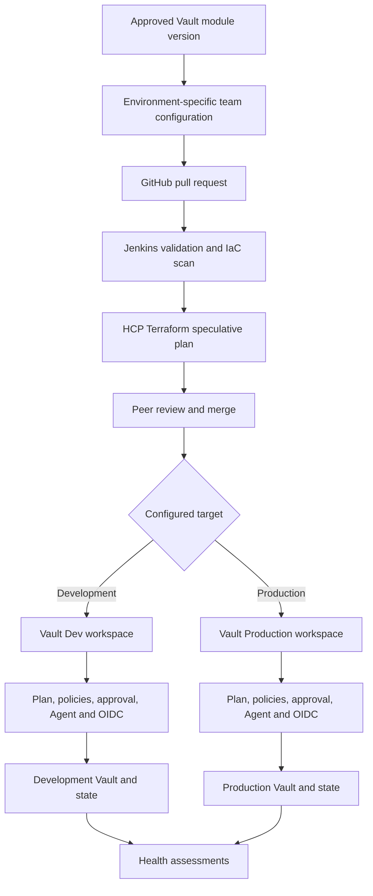
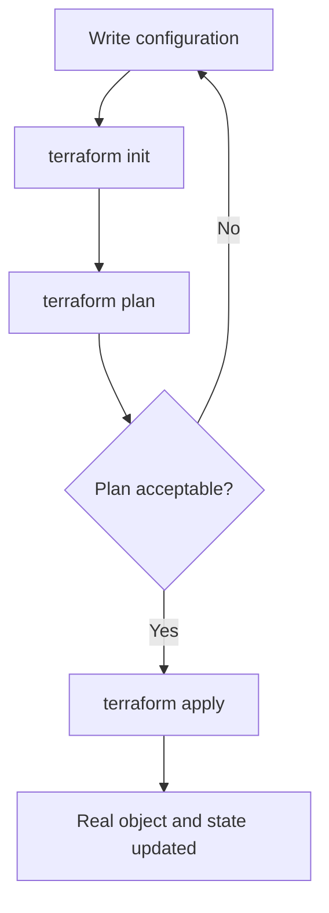

# Nutanix Terraform and Vault Enablement

<!-- markdownlint-disable MD013 MD024 -->

Trainer runbook for a phased HCP Terraform and Vault workshop series.

## How to use this guide

This is written for a trainer with limited Terraform and Vault experience. Do not
attempt the exercises for the first time during a customer session. Run every lab
yourself, capture expected screenshots, and keep a recorded or screenshot-based
backup for each demonstration.

The program uses one continuous pilot:

> Manage one team configuration in the development Vault cluster with reusable
> Terraform code, version-controlled inputs, review, security checks, approval,
> state management, and drift detection.

The pilot is deliberately small. Do not begin by importing all 60-65 existing
team namespaces.

## Confirmed customer baseline

- The team already uses HCP Terraform workspaces and HCP-managed state.
- Terraform code is stored and peer-reviewed in GitHub.
- Most HCP Terraform runs are currently started through the Terraform CLI.
- The target is a more formal VCS-driven workflow.
- CI is moving from CircleCI to Jenkins.
- Vault Enterprise has separate development and production clusters.
- Vault contains approximately 60-65 team namespaces.
- Current Vault automation uses Python libraries and some manual operations.
- The relevant Vault resources are not currently managed in Terraform state.
- The team has mixed foundational and intermediate Terraform experience.
- The immediate goal is Vault standardization. Broader enterprise governance is
  a future workstream.

## Training outcomes

By the end of the series, attendees should be able to:

1. Explain configuration, providers, resources, data sources, plans, applies,
   and state.
2. Explain the difference between Terraform Community and HCP Terraform.
3. Build and consume a small reusable Vault module.
4. Drive team configuration from non-sensitive JSON inputs.
5. Import an existing Vault resource safely.
6. Use a `moved` block when refactoring an existing resource address.
7. Explain the target GitHub, Jenkins, and HCP Terraform workflow.
8. Explain the difference between Agent connectivity and OIDC authentication.
9. Place static scanning, run tasks, policy checks, Vault EGP, and drift
   detection in the correct layers.
10. Explain how projects, workspaces, teams, policies, and approved modules
    support federated governance.

## Scope boundaries

### Included

- Terraform and HCP Terraform baseline review
- Vault provider fundamentals
- Modules, JSON inputs, `for_each`, conditions, validations, and templates
- Import blocks, CLI import, generated configuration, data sources, and moved
  blocks
- VCS-driven HCP Terraform runs
- Jenkins-based validation and static scanning
- Workspace and state boundaries
- HCP Terraform Agents and Vault OIDC dynamic credentials
- Approvals, run tasks, policy enforcement, and health assessments
- Private registry, RBAC, multi-tenancy, and delegated governance
- Infragraph overview

### Not included in the initial pilot

- Production changes
- Bulk import of all existing Vault resources
- Vault cluster installation or upgrades
- Disaster recovery or performance replication configuration
- Full Okta group mapping
- Full EGP/RGP policy redesign
- Scanner product evaluation or procurement
- Periodic inactive-entity cleanup
- Emergency bulk disable or enable operations
- Upgrade qualification and functional testing
- One-time data migration orchestration

The excluded operational activities may use Vault APIs, scripts, Jenkins jobs,
or another orchestration platform. Terraform should manage desired state, not
become a general-purpose job runner.

## Program structure

| Session | Duration | Focus | Practical result |
| --- | ---: | --- | --- |
| 1 | 60 minutes | Terraform and HCP Terraform baseline | Read a plan and explain state |
| 2 | 60 minutes | Vault modules and JSON configuration | Build reusable Vault configuration |
| 3 | 60 minutes | Import and refactoring | Adopt one existing resource safely |
| 4 | 60 minutes | HCP workflow, security, and drift | Walk through the governed run lifecycle |
| 5 | 60 minutes | Registry, RBAC, governance, and Infragraph | Define the scale-out operating model |

If only three sessions are approved, combine Sessions 1 and 2, keep Session 3
separate, and combine Sessions 4 and 5. Do not remove the import session or the
security distinctions.

## Target pattern

The customer does not have a mandatory dev-to-prod promotion model. A team can
exist in development, production, or both. The same approved module can be used
with separate environment configuration, workspaces, state, and approvals.



## Before you teach anything

### Customer prerequisites

Confirm these at least five business days before the first technical demo:

- [ ] Named development Vault pilot namespace or pilot team
- [ ] Exact resources included in the pilot
- [ ] HCP Terraform organization and project names
- [ ] GitHub repository for the pilot
- [ ] Jenkins runner with Terraform and the selected scanner installed
- [ ] Development Vault endpoint and CA chain
- [ ] HCP Terraform Agent pool with network access to development Vault
- [ ] Vault administrator available for the authentication session
- [ ] Approved Vault role and least-privilege policy design
- [ ] Module owner and backup owner
- [ ] Development approvers
- [ ] Approved static scanner, such as standalone Trivy, Checkov, or Cycode
- [ ] Confirmation that no secrets will be placed in JSON or Git

If Agent connectivity or Vault authentication is not ready, demonstrate the
workflow using screenshots and run the local backup lab instead. Do not attempt
to fix customer network or identity configuration live.

### Trainer prerequisites

- [ ] Install Terraform CLI 1.5 or later.
- [ ] Install Git.
- [ ] Install Vault CLI.
- [ ] Install Docker or another disposable container runtime.
- [ ] Complete the local Terraform baseline lab twice.
- [ ] Complete the local Vault provider lab twice.
- [ ] Complete the import and moved-block lab twice.
- [ ] Rehearse each customer-facing explanation aloud.
- [ ] Save screenshots of every successful step.
- [ ] Prepare a clean repository before each session.
- [ ] Have a Vault SME review the Enterprise namespace and OIDC sections.

## Critical concepts for the trainer

| Term | Simple explanation |
| --- | --- |
| Configuration | The Terraform files that describe the desired result. |
| Provider | The plugin Terraform uses to call an API, such as Vault. |
| Resource | Something Terraform creates or manages. |
| Data source | Read-only information queried from an API. It does not import or own the object. |
| State | Terraform's record that maps resource addresses to real objects. |
| Plan | A preview of the changes Terraform proposes. |
| Apply | Execution of an approved plan. |
| Module | Reusable Terraform configuration with defined inputs and outputs. |
| Import | Connects an existing object to a Terraform resource address in state. |
| Moved block | Changes a Terraform resource address without recreating the object. |
| Workspace | An HCP Terraform execution and state boundary. |
| Project | An HCP Terraform grouping and access boundary for workspaces and Stacks. |
| Agent | Executes HCP Terraform runs inside a private network. |
| OIDC dynamic credentials | Short-lived identity used by a run to authenticate to Vault. |
| Run task | An external integration called during an HCP Terraform run. |
| Health assessment | Periodic drift detection and continuous validation in HCP Terraform. |

Remember these corrections:

- Modules do not know the existing state. State tracks deployed objects.
- Data sources do not import or manage resources.
- Import does not guarantee a no-change plan.
- Agents provide network reachability. OIDC provides authentication.
- Run tasks do not promote environments.
- Production repetition is intentional because production has separate state
  and approval boundaries.
- HCP Terraform drift detection identifies configuration drift. It is not an
  automatic remediation engine.
- Sensitive variables redact display. They do not automatically remove values
  from state.

## Session 1: Terraform and HCP Terraform baseline

### Session objective

Attendees will understand the Terraform lifecycle and how HCP Terraform adds
remote execution, shared state, VCS integration, approvals, RBAC, policies, and
audit history.

### Timing

| Time | Activity |
| --- | --- |
| 0-5 | Objectives and customer baseline |
| 5-15 | Configuration, provider, resource, plan, apply, and state |
| 15-25 | Terraform Community versus HCP Terraform |
| 25-40 | Local baseline demonstration |
| 40-50 | Target Vault workflow and workspace boundaries |
| 50-60 | Questions and checkpoint |

### Opening script

Say:

> Today is a short level set. Your team already uses HCP Terraform, so this is
> not a full beginner class. We will establish a shared vocabulary, review the
> plan and apply lifecycle, and connect those concepts to the Vault pilot.

Then say:

> Terraform configuration describes the desired state. The provider calls the
> target API. Terraform compares configuration, state, and the real object to
> create a plan. Apply executes the approved plan and updates state.

### Core lifecycle



### Demo 1: A provider-free Terraform example

This lab uses the built-in `terraform_data` resource. It teaches the workflow
without cloud credentials or customer infrastructure.

#### Step 1: Create a working directory

```bash
mkdir terraform-baseline
cd terraform-baseline
```

#### Step 2: Create `versions.tf`

```hcl
terraform {
  required_version = ">= 1.5.0"
}
```

Explain:

- `required_version` prevents the lab from running on an unsupported Terraform
  version.
- There is no external provider because `terraform_data` is built into
  Terraform.

#### Step 3: Create `variables.tf`

```hcl
variable "team_name" {
  description = "Name of the team requesting onboarding."
  type        = string

  validation {
    condition     = can(regex("^[a-z][a-z0-9-]{2,30}$", var.team_name))
    error_message = "Use 3-31 lowercase letters, numbers, or hyphens."
  }
}

variable "environment" {
  description = "Target environment."
  type        = string

  validation {
    condition     = contains(["dev", "prod"], var.environment)
    error_message = "Environment must be dev or prod."
  }
}
```

#### Step 4: Create `main.tf`

```hcl
resource "terraform_data" "team_request" {
  input = {
    team_name   = var.team_name
    environment = var.environment
  }
}

output "request" {
  description = "Validated onboarding request."
  value       = terraform_data.team_request.output
}
```

#### Step 5: Create `terraform.tfvars`

```hcl
team_name   = "payments"
environment = "dev"
```

#### Step 6: Run the workflow

```bash
terraform version
terraform init
terraform fmt -check
terraform validate
terraform plan -out=tfplan
terraform apply tfplan
terraform state list
terraform output
```

Expected result:

```text
terraform_data.team_request
```

The output should show `payments` and `dev`.

#### Step 7: Demonstrate a change

Change `team_name` in `terraform.tfvars` to `analytics`, then run:

```bash
terraform plan
```

Explain the symbols in the plan. Do not apply until the class identifies the
expected change.

#### Step 8: Demonstrate validation

Change the team name to `Payments Team`, then run:

```bash
terraform plan
```

Expected result: Terraform rejects the input validation. Restore the value to
`payments` afterward.

#### Step 9: Clean up

```bash
terraform destroy
```

This only removes the local `terraform_data` resource from state.

### Terraform Community versus HCP Terraform

| Capability | Terraform Community | HCP Terraform |
| --- | --- | --- |
| Terraform language and CLI | Yes | Yes |
| Local execution | Yes | Optional |
| Shared remote execution | External setup required | Built in |
| Shared state and locking | External backend required | Built in |
| VCS-triggered runs | External CI required | Built in |
| Team RBAC | External | Built in by edition |
| Private registry | External | Built in |
| Policy enforcement | External | Built in by edition |
| Health assessments | No | Available by edition |

### Session checkpoint questions

Ask attendees:

1. What is the difference between configuration and state?
2. What does a plan show?
3. Why should production state be separate from development state?
4. What does HCP Terraform add to the CLI workflow?

Do not continue until someone can explain configuration, plan, apply, and state
in their own words.

## Session 2: Vault modules and JSON configuration

### Session objective

Attendees will build reusable Terraform configuration that creates a Vault KV
mount and policy from non-sensitive JSON inputs.

This local lab uses Vault Community in development mode. Vault namespaces are
Enterprise-only, so the local lab creates policies and secrets engines. The
customer demonstration can extend the same pattern with `vault_namespace` in
their approved development Vault Enterprise environment.

### Timing

| Time | Activity |
| --- | --- |
| 0-10 | Vault provider and module concepts |
| 10-20 | Start disposable Vault and review safety rules |
| 20-45 | Build and apply the reusable module |
| 45-52 | Show the Enterprise namespace extension |
| 52-60 | Questions and checkpoint |

### Opening script

Say:

> The reusable module defines the approved Vault pattern. The JSON file only
> supplies non-sensitive team-specific inputs. Terraform uses `for_each` to
> create one module instance for each configured team.

Then clarify:

> The shared module is the single code pattern. Development and production
> still need separate configuration, workspaces, state, and approvals.

### Safety rules

- Use only a disposable local Vault or the approved development Vault.
- Never place a root token in HCP Terraform, Jenkins, GitHub, or the README.
- Never commit secrets, passwords, tokens, or private keys in JSON.
- Do not use this lab against production.
- The local root token exists only because this is a disposable development
  server.

### Demo 2: Start a disposable Vault server

Use the customer-approved Vault version. This example uses the version observed
in the customer notes. Confirm the image tag before the workshop.

```bash
docker run --rm \
  --cap-add=IPC_LOCK \
  --name vault-training \
  -e VAULT_DEV_ROOT_TOKEN_ID=training-root \
  -e VAULT_DEV_LISTEN_ADDRESS=0.0.0.0:8200 \
  -p 8200:8200 \
  hashicorp/vault:1.21.4
```

Open a second terminal:

```bash
export VAULT_ADDR=http://127.0.0.1:8200
export VAULT_TOKEN=training-root
vault status
```

If the Vault CLI is unavailable, verify through the container:

```bash
docker exec vault-training vault status
```

Expected result: Vault is initialized, unsealed, and running in development
mode.

### Create the module repository structure

```text
vault-team-training/
|-- main.tf
|-- outputs.tf
|-- teams.json
|-- versions.tf
`-- modules/
    `-- team-config/
        |-- main.tf
        |-- outputs.tf
        |-- variables.tf
        `-- templates/
            `-- reader-policy.hcl.tftpl
```

Create the directories:

```bash
mkdir -p vault-team-training/modules/team-config/templates
cd vault-team-training
```

### Root configuration

#### Create `versions.tf`

```hcl
terraform {
  required_version = ">= 1.5.0"

  required_providers {
    vault = {
      source  = "hashicorp/vault"
      version = "~> 5.0"
    }
  }
}

provider "vault" {}
```

The provider reads `VAULT_ADDR` and `VAULT_TOKEN` from the local environment.
This local token pattern is not the HCP Terraform production design.

#### Create `teams.json`

```json
{
  "teams": {
    "payments": {
      "enable_kv": true
    }
  }
}
```

#### Create root `main.tf`

```hcl
locals {
  team_configuration = jsondecode(file("${path.module}/teams.json"))
  teams              = local.team_configuration.teams
}

module "team_config" {
  source   = "./modules/team-config"
  for_each = local.teams

  team_name = each.key
  enable_kv = try(each.value.enable_kv, true)
}
```

#### Create root `outputs.tf`

```hcl
output "team_mounts" {
  description = "KV mount created for each configured team."
  value = {
    for team_name, team_module in module.team_config :
    team_name => team_module.mount_path
  }
}
```

### Child module configuration

#### Create `modules/team-config/variables.tf`

```hcl
variable "team_name" {
  description = "Short lowercase team identifier."
  type        = string

  validation {
    condition     = can(regex("^[a-z][a-z0-9-]{2,30}$", var.team_name))
    error_message = "Use 3-31 lowercase letters, numbers, or hyphens."
  }
}

variable "enable_kv" {
  description = "Whether to create the team's KV v2 secrets engine."
  type        = bool
  default     = true
}
```

#### Create `modules/team-config/templates/reader-policy.hcl.tftpl`

```hcl
path "${mount_path}/data/*" {
  capabilities = ["read", "list"]
}

path "${mount_path}/metadata/*" {
  capabilities = ["read", "list"]
}
```

#### Create `modules/team-config/main.tf`

```hcl
terraform {
  required_providers {
    vault = {
      source = "hashicorp/vault"
    }
  }
}

locals {
  mount_path = "${var.team_name}-kv"
}

resource "vault_mount" "team_kv" {
  count = var.enable_kv ? 1 : 0

  path        = local.mount_path
  type        = "kv"
  description = "KV v2 engine for ${var.team_name}"

  options = {
    version = "2"
  }
}

resource "vault_policy" "team_reader" {
  count = var.enable_kv ? 1 : 0

  name = "${var.team_name}-reader"
  policy = templatefile(
    "${path.module}/templates/reader-policy.hcl.tftpl",
    { mount_path = local.mount_path }
  )
}
```

#### Create `modules/team-config/outputs.tf`

```hcl
output "mount_path" {
  description = "Created KV mount path, or null when disabled."
  value       = var.enable_kv ? vault_mount.team_kv[0].path : null
}
```

### Run the module

```bash
terraform init
terraform fmt -recursive
terraform validate
terraform plan -out=tfplan
terraform apply tfplan
terraform state list
vault secrets list
vault policy read payments-reader
```

Expected Terraform state addresses:

```text
module.team_config["payments"].vault_mount.team_kv[0]
module.team_config["payments"].vault_policy.team_reader[0]
```

### Add a second team

Update `teams.json`:

```json
{
  "teams": {
    "analytics": {
      "enable_kv": true
    },
    "payments": {
      "enable_kv": true
    }
  }
}
```

Run:

```bash
terraform plan
```

Ask the class to identify which resources will be added before applying.

This demonstrates:

- `jsondecode` for configuration inputs
- `for_each` for one module instance per stable team key
- `count` for a conditional resource
- input validation
- `templatefile` for a Vault policy
- modules for reusable patterns

Do not apply the second team unless time allows.

### Enterprise namespace extension

The local lab cannot create Vault Enterprise namespaces. In the customer
development environment, the module can include a namespace resource similar
to this:

```hcl
resource "vault_namespace" "team" {
  namespace = var.parent_namespace
  path      = var.team_name
}

resource "vault_mount" "team_kv" {
  namespace = vault_namespace.team.path_fq
  path      = "kv"
  type      = "kv"

  options = {
    version = "2"
  }
}
```

The final customer module must be reviewed against their existing two-level
namespace model, EGP restrictions, Okta identity mappings, auth method rules,
secret-sync restrictions, and quotas. Do not copy this small example directly
into production.

### Session checkpoint questions

1. What belongs in the module?
2. What belongs in JSON?
3. Why must JSON contain no sensitive values?
4. Why is `for_each` safer with stable team names than list indexes?
5. Why can the same module use different dev and prod configuration?

### Local cleanup

```bash
terraform destroy
docker stop vault-training
```

## Session 3: Import and refactor existing Vault resources

### Session objective

Attendees will understand how to connect one existing Vault resource to
Terraform state, reconcile the first plan, and refactor its Terraform address
without recreating it.

### Timing

| Time | Activity |
| --- | --- |
| 0-10 | Resource, data source, state, import, and moved-block distinctions |
| 10-20 | Inventory and migration safety |
| 20-40 | Import one existing local Vault resource |
| 40-50 | Reconcile the first plan and discuss generated configuration |
| 50-57 | Refactor with a moved block |
| 57-60 | Checkpoint and next action |

### Opening script

Say:

> Import does not move or recreate the Vault object. It records a relationship
> between a Terraform resource address and an existing Vault object. Terraform
> still needs configuration describing the desired state.

Then say:

> The first plan after import is the safety gate. If the configuration does not
> match the existing object, Terraform can propose an update or replacement.
> We do not apply until every proposed action is understood.

### Import safety checklist

- [ ] Confirm the provider version.
- [ ] Confirm that the resource supports import.
- [ ] Read the resource-specific import ID format.
- [ ] Inventory the existing object.
- [ ] Back up current configuration and state.
- [ ] Write or generate the Terraform resource configuration.
- [ ] Import one development resource.
- [ ] Run and review the first plan.
- [ ] Reconcile all unintended differences.
- [ ] Obtain approval before apply.
- [ ] Document rollback and ownership.

### Data source versus import

```hcl
data "vault_namespaces" "existing" {
  namespace = "nutanix"
  recursive = true
}
```

This data source can read namespace information. It does not put those
namespaces under Terraform management. Import is required when Terraform must
own their lifecycle.

### Demo 3: Create an unmanaged Vault resource

Start the disposable Vault server from Session 2, then create a mount outside
Terraform:

```bash
export VAULT_ADDR=http://127.0.0.1:8200
export VAULT_TOKEN=training-root
vault secrets enable -path=legacy-kv kv-v2
vault secrets list
```

Terraform does not know about `legacy-kv` yet.

### Option A: Traditional CLI import

Create a clean directory and a configuration containing:

```hcl
terraform {
  required_version = ">= 1.5.0"

  required_providers {
    vault = {
      source  = "hashicorp/vault"
      version = "~> 5.0"
    }
  }
}

provider "vault" {}

resource "vault_mount" "legacy" {
  path = "legacy-kv"
  type = "kv"

  options = {
    version = "2"
  }
}
```

Run:

```bash
terraform init
terraform import vault_mount.legacy legacy-kv
terraform state show vault_mount.legacy
terraform plan
```

The import command changes state immediately. It does not generate the
resource block.

### Option B: Declarative import block

Use this instead of the CLI import when the import must be reviewed through
Git and HCP Terraform:

```hcl
import {
  to = vault_mount.legacy
  id = "legacy-kv"
}
```

Then run:

```bash
terraform plan
terraform apply
```

Do not run Options A and B against the same state. They are two alternative
methods.

### Generated configuration

When a resource block does not yet exist, an import block can be combined with:

```bash
terraform plan -generate-config-out=generated.tf
```

Generated configuration is a starting point. Review and simplify it before
apply. It may include defaults, computed-looking values, or arguments that do
not match the desired module design.

### Importing a namespaced Vault resource

Vault provider imports inside a namespace require the import namespace to be
specified. Example:

```bash
export TERRAFORM_VAULT_NAMESPACE_IMPORT="nutanix/payments"
terraform import vault_mount.team_kv kv
unset TERRAFORM_VAULT_NAMESPACE_IMPORT
```

Important:

- Use the exact namespace path and import ID from the provider documentation.
- Set this variable only for the import.
- For HCP Terraform imports, configure the temporary environment setting only
  in the controlled import workspace and remove it afterward.
- Test this against one development namespace first.

### Reconcile the first plan

Possible results:

| Plan result | Meaning | Action |
| --- | --- | --- |
| No changes | Configuration matches the object | Continue review |
| In-place update | An argument differs | Decide whether code or Vault is correct |
| Replacement | A force-new argument differs | Stop and investigate |
| Delete | Terraform no longer sees desired ownership | Stop immediately |
| Error | Configuration, permissions, or import ID is incomplete | Fix before continuing |

Never say that import automatically produces a no-change plan.

### Refactor with a moved block

Assume `vault_mount.legacy` is already managed and is being moved into a
module. After creating the destination module and removing the old root
resource block, declare:

```hcl
moved {
  from = vault_mount.legacy
  to   = module.legacy_mount.vault_mount.this
}
```

Run:

```bash
terraform plan
```

Expected result: Terraform reports an address move instead of destroy and
create. The destination address must match the actual module resource address.

Best practice for new migrations: if the final module address is already known,
import directly to that final address and avoid an unnecessary intermediate
move.

### Customer pilot import order

Use this order for one development namespace:

1. Namespace
2. Secrets engine mounts
3. ACL policies
4. Identity groups and aliases
5. Auth method configuration
6. Quotas or governance resources

The exact order depends on dependencies. Do not import identity groups until
the Okta auth accessor, aliases, ownership, and policy behavior are understood.

### Session checkpoint questions

1. What does import change?
2. Why is the first plan risky?
3. What does a data source not do?
4. When should a moved block be used?
5. Why should the pilot import only one development namespace?

## Session 4: HCP Terraform workflow, security, and drift

### Session objective

Attendees will understand the target VCS-driven run lifecycle and how private
connectivity, short-lived identity, scanning, policy enforcement, approval,
state, and health assessments fit together.

### Timing

| Time | Activity |
| --- | --- |
| 0-10 | Current CLI-driven workflow versus target VCS workflow |
| 10-20 | Repository, project, workspace, and state design |
| 20-30 | Jenkins and speculative plans |
| 30-42 | Agent connectivity and OIDC authentication |
| 42-52 | Scanning, run tasks, Sentinel/OPA, and Vault EGP |
| 52-60 | Approval and drift demonstration |

### Opening script

Say:

> Your code is already reviewed in GitHub, but most HCP Terraform runs are
> started manually through the CLI. The target is to connect the workspace to
> GitHub so pull requests produce speculative plans and approved merges produce
> governed execution runs.

Then say:

> Two security layers are easy to confuse. The HCP Terraform Agent gives the
> run a private network path to Vault. OIDC gives that run a short-lived Vault
> identity. We need both when Vault is private.

### Current and target workflow

Current:

1. Code is stored and peer-reviewed in GitHub.
2. An operator pulls the code locally.
3. The operator starts the HCP Terraform run through the CLI.

Target:

1. A pull request triggers Jenkins validation and an HCP Terraform speculative
   plan.
2. Peers review the code and plan.
3. Merge triggers a normal HCP Terraform run.
4. Run tasks and policy checks evaluate the change.
5. An authorized user confirms the apply.
6. An HCP Terraform Agent reaches private Vault.
7. HCP Terraform authenticates to Vault with short-lived OIDC credentials.
8. Apply updates Vault and the workspace state.
9. Health assessments monitor configuration drift.

### Recommended repository structure

```text
vault-platform/
|-- modules/
|   `-- team-namespace/
|-- live/
|   |-- dev/
|   |   |-- main.tf
|   |   `-- teams.json
|   `-- prod/
|       |-- main.tf
|       `-- teams.json
|-- Jenkinsfile
`-- README.md
```

For the long-term private registry model, move the reusable module to its own
repository and publish tagged versions. Keep consumer configuration separate.

### Workspace and state starting point

| HCP project | Workspace | Owns |
| --- | --- | --- |
| Vault Dev | `vault-team-pilot-dev` | One development pilot namespace |
| Vault Production | Not part of initial pilot | Future production resources |
| Vault Platform | Future restricted workspace | Shared root or org-level resources |

Do not create one state containing all root resources and all 60-65 team
namespaces. Final workspace granularity should be based on ownership, lifecycle,
dependencies, and blast radius.

### HCP Terraform workspace setup checklist

1. Create or select the Vault Dev project.
2. Create `vault-team-pilot-dev`.
3. Connect the GitHub repository through the approved GitHub App connection.
4. Set the working directory to the pilot development root configuration.
5. Select Agent execution mode when Vault is private.
6. Select the approved Agent pool.
7. Disable auto-apply.
8. Pin the Terraform version.
9. Assign least-privilege team access.
10. Configure Vault dynamic credential environment variables.
11. Add applicable policy sets and run tasks.
12. Enable health assessments after the first successful apply.

### Jenkins validation example

Use the customer's approved scanner. The following is a teaching example, not
a production Jenkins standard:

```groovy
pipeline {
  agent any

  stages {
    stage('Terraform format') {
      steps {
        sh 'terraform fmt -check -recursive'
      }
    }

    stage('Terraform validate') {
      steps {
        sh 'terraform -chdir=live/dev init -backend=false'
        sh 'terraform -chdir=live/dev validate'
      }
    }

    stage('Terraform IaC scan') {
      steps {
        sh 'trivy config --exit-code 1 --severity HIGH,CRITICAL .'
      }
    }
  }
}
```

Checkov alternative:

```bash
checkov -d . --framework terraform --compact
```

Harbor is primarily a registry and container image scanning platform. If Harbor
uses Trivy, that does not automatically mean Terraform files are scanned in the
Git workflow. Standalone Trivy or another approved IaC scanner must be placed in
the repository pipeline.

### Agent connectivity versus OIDC authentication

| Layer | Purpose | Question to verify |
| --- | --- | --- |
| HCP Terraform Agent | Runs Terraform inside the private network | Can the Agent resolve and reach the Vault API and CA? |
| OIDC workload identity | Authenticates the HCP Terraform run to Vault | Does Vault trust the HCP Terraform issuer and claims? |
| Vault role and policy | Authorizes permitted Vault paths and operations | Are plan and apply permissions least privilege? |

Do not describe the Agent as the credential. It is the execution and network
path.

### Vault dynamic credential workspace variables

For a single Vault provider configuration, the HCP Terraform workspace commonly
uses variables such as:

```text
TFC_VAULT_PROVIDER_AUTH=true
TFC_VAULT_ADDR=https://vault.example.com:8200
TFC_VAULT_RUN_ROLE=vault-team-pilot
TFC_VAULT_NAMESPACE=nutanix
```

For stronger separation, configure different roles:

```text
TFC_VAULT_PLAN_ROLE=vault-team-pilot-plan
TFC_VAULT_APPLY_ROLE=vault-team-pilot-apply
```

With a single dynamic credential configuration, do not hard-code the Vault
address, token, or namespace in the provider block:

```hcl
provider "vault" {}
```

A Vault administrator must configure the JWT auth method, trust, bound claims,
roles, policies, TTLs, and CA requirements. Bind at least the audience and HCP
Terraform organization. Prefer workspace- or project-scoped claims and
short-lived renewable tokens. Do not configure this live without the Vault
administrator.

### Security control layers

| Control | Evaluates | Runs when | Example |
| --- | --- | --- | --- |
| `terraform fmt` and `validate` | Syntax and internal validity | Before plan | Jenkins |
| Trivy, Checkov, or Cycode | Static Terraform configuration | Pull request | Jenkins |
| HCP Terraform run task | External service result | Configured run stage | Security integration |
| Sentinel, OPA, or Terraform policy | Terraform plan and metadata | HCP Terraform run | Required tags or approved modules |
| Vault EGP/RGP | Vault API requests and governance | Vault request time | Prevent unsupported namespace depth |
| Health assessment | Deployed configuration drift and checks | Periodically after apply | Manual policy change detected |

Do not treat these tools as interchangeable.

### Approval flow

For the pilot:

1. Jenkins checks pass.
2. HCP speculative plan is reviewed in the pull request.
3. Peer approves and merges.
4. HCP Terraform creates a new execution plan.
5. Run tasks and policies pass.
6. A designated development approver confirms apply.

Production must have a separate workspace, state, authorization, and approval
process even when it uses the same module version.

### Drift demonstration

Prerequisite: at least one successful remote or Agent-mode apply and health
assessments enabled.

1. Record the expected Terraform-managed Vault policy.
2. Make a controlled manual change in development Vault.
3. In HCP Terraform, open the workspace Health page.
4. Start an on-demand health assessment if permitted, or wait for the scheduled
   assessment.
5. Review the drift result.
6. Choose one remediation path:
   - Reject the manual change and apply Terraform to restore configuration.
   - Accept the manual change by updating Git, reviewing the plan, and applying.
7. Never silently update state to hide an unexplained change.

Clarify that health assessments detect configuration drift. They do not
automatically revert the manual change.

### Session checkpoint questions

1. What triggers a speculative plan?
2. What happens after merge when auto-apply is disabled?
3. What is the difference between an Agent and OIDC?
4. What is the difference between Checkov and Sentinel?
5. What are the two valid drift remediation choices?

## Session 5: Registry, RBAC, governance, and Infragraph

### Session objective

Attendees will understand how the Vault pilot can become a reusable federated
governance pattern without the Product Security team owning every other team's
Terraform code.

### Timing

| Time | Activity |
| --- | --- |
| 0-15 | Private registry and module lifecycle |
| 15-30 | Projects, teams, RBAC, and delegated administration |
| 30-42 | Policy-as-code rollout and exceptions |
| 42-50 | Desired state versus operational jobs |
| 50-57 | Infragraph overview and limitations |
| 57-60 | Roadmap and success criteria |

### Opening script

Say:

> The Vault pilot is the first implementation of a larger operating model. The
> goal is not for Product Security to own every team's Terraform code. The goal
> is to provide approved modules, access boundaries, policies, and visibility
> while each team remains accountable for its own deployments.

### Federated governance model

The platform team should not own every team's Terraform code and every apply.
The target operating model is:

#### Platform or Product Security team owns

- HCP Terraform organization and project standards
- Approved private registry modules
- Module testing, versioning, and deprecation process
- Global and scoped policy sets
- Identity, team, and permission standards
- Agent pool standards
- Dynamic credential patterns
- Audit, drift, and governance visibility
- Exception and policy override process

#### Application and infrastructure teams own

- Their consumer configuration
- Their environment-specific inputs
- Their repositories and pull requests
- Their workspace runs within delegated permissions
- Their infrastructure outcomes
- Remediation of failed plans, policies, and drift

### Suggested HCP Terraform roles

| Role | Responsibilities | Must not automatically receive |
| --- | --- | --- |
| Organization owner | Limited break-glass administration | Routine workspace operation |
| Platform module author | Build and publish approved modules | Production apply everywhere |
| Security policy author | Maintain policy code and enforcement | Infrastructure ownership |
| Project administrator | Manage an assigned project and team access | Organization-wide ownership |
| Workspace operator | Queue plans and review results | Unrestricted policy override |
| Production approver | Confirm approved production applies | Module deletion rights |
| Viewer or auditor | Read runs, state outputs, and history as allowed | Apply permissions |

Use SSO and SCIM group mappings where supported. Grant permissions to teams or
groups rather than individuals. Review the current situation where much of the
team can approve production changes.

### Private registry lifecycle

1. Create a dedicated module repository.
2. Define inputs, outputs, examples, and documentation.
3. Add Terraform tests.
4. Run formatting, validation, tests, and security scans.
5. Require pull-request review.
6. Tag a semantic version, such as `v1.0.0`.
7. Publish the module to the HCP Terraform private registry.
8. Pin consumers to an approved version.
9. Publish backward-compatible changes as minor versions.
10. Publish breaking changes as major versions.
11. Deprecate old versions with a migration path and deadline.

Do not update the module and every consumer input in one uncontrolled change.
Publish and test the module version first, then promote consumer configuration.

### Starter policy rollout

Begin in advisory mode. Measure failures and false positives before blocking
runs.

Recommended starter controls:

- Allowed providers
- Pinned provider versions
- Approved private registry modules
- Pinned module versions
- Required ownership and environment metadata
- No dangerous provisioners unless explicitly approved
- No production auto-apply
- Restricted policy overrides
- Environment-specific restrictions

Move critical, stable controls to mandatory enforcement only after an exception
process exists.

### Vault EGP versus HCP Terraform policy

| Control | Enforcement point | Example |
| --- | --- | --- |
| HCP Terraform Sentinel/OPA | Terraform run before apply | Require approved modules or metadata |
| Vault EGP/RGP | Vault API request | Deny third-level namespaces or restricted operations |

Use both when required. HCP Terraform policies govern Terraform changes. Vault
EGP/RGP protects Vault even when a request comes from another approved client.

### Desired state versus operational automation

| Appropriate for Terraform | Better as an operational workflow |
| --- | --- |
| Namespace existence | Delete entities based on inactivity |
| ACL policy definition | Scheduled cleanup jobs |
| Identity group configuration | Emergency bulk disable or enable |
| Auth method configuration | Functional tests after upgrades |
| Secrets engine configuration | One-time data migrations |
| Quotas and EGP/RGP definitions | Runtime decisions based on activity history |

Terraform can manage the desired enabled or disabled state of a known object.
It should not query runtime behavior, decide who is inactive, and act as a
scheduler.

### Self-service options

After the module is proven:

1. Allow experienced teams to consume the versioned module through HCL and VCS.
2. Make the module no-code ready for controlled HCP Terraform self-service.
3. Consider HCP Waypoint templates for broader application-focused golden
   patterns.

Do not call the current public Waypoint construct a blueprint. The public terms
are HCP Terraform no-code module, HCP Waypoint template, and HCP Waypoint
add-on.

### Infragraph overview

Explain:

> Infragraph is an HCP resource graph that connects supported data sources and
> helps users explore infrastructure inventory and relationships through
> queries and graph views.

Keep this section to an overview unless the customer has access and has
completed connection prerequisites.

Important limitations to state:

- It is not real-time.
- It does not perform HCP Terraform drift detection.
- It does not automatically detect or remediate vulnerabilities.
- Supported connections and resource types are limited.
- Availability and beta status must be confirmed for the customer's region and
  subscription before demonstration.

### Session checkpoint questions

1. What does the central platform team own?
2. What do application teams continue to own?
3. Why should policies begin in advisory mode?
4. Why are Vault EGP and Sentinel not interchangeable?
5. What does Infragraph not replace?

## Pilot execution plan

### Phase 1: Design

- Select one development namespace or one new team onboarding request.
- Inventory its namespace, policies, groups, auth requirements, secrets engines,
  quotas, and dependencies.
- Decide the final Terraform resource addresses before import.
- Define the workspace and state boundary.
- Define module ownership and approval roles.
- Define Vault Agent connectivity and OIDC requirements.

### Phase 2: Build

- Create the module repository.
- Create the development consumer configuration.
- Define non-sensitive JSON inputs.
- Add validation and Terraform tests.
- Add Jenkins static checks.
- Publish or pin the first approved module version.

### Phase 3: Import or create

- For a new pilot team, create the resources through Terraform.
- For an existing pilot team, import one resource category at a time.
- Reconcile every first plan.
- Use moved blocks only when resource addresses change.

### Phase 4: Govern

- Connect the workspace to GitHub.
- Disable auto-apply.
- Configure Agent execution.
- Configure Vault OIDC dynamic credentials.
- Add policy checks and the approved scanner integration.
- Apply through authorized approval.

### Phase 5: Validate

- Confirm Vault resources match the approved configuration.
- Confirm state contains the expected resource addresses.
- Confirm no secrets were committed or exposed in plan output.
- Create controlled development drift.
- Confirm the drift is detected and reviewed.
- Document lessons before expanding.

## Pilot success criteria

The pilot succeeds only if:

- [ ] One engineer can onboard or manage the pilot team through reviewed
  configuration.
- [ ] The reusable module produces consistent resources.
- [ ] The workspace owns only the intended development resources.
- [ ] The plan contains no unintended deletion or replacement.
- [ ] Jenkins checks pass.
- [ ] HCP Terraform policy and approval gates work.
- [ ] The Agent can reach Vault without exposing Vault publicly.
- [ ] HCP Terraform authenticates with short-lived credentials.
- [ ] State is stored in HCP Terraform and access is restricted.
- [ ] A controlled manual change is detected as drift.
- [ ] Operational jobs remain outside the Terraform state workflow.
- [ ] Module owner, approver, and support ownership are documented.

## Trainer troubleshooting guide

| Symptom | Likely cause | Safe response |
| --- | --- | --- |
| `terraform init` cannot download provider | Network, proxy, or registry restriction | Use the prepared environment or screenshots |
| Vault connection refused | Container stopped or wrong `VAULT_ADDR` | Check `docker ps` and `vault status` |
| Vault returns 403 | Token or policy lacks capability | Stop and ask the Vault administrator |
| HCP run cannot reach Vault | Agent DNS, routing, firewall, or CA issue | Do not switch to public access; validate Agent path |
| OIDC authentication fails | Issuer, audience, bound claims, role, namespace, or CA mismatch | Compare against the approved trust configuration |
| Import returns permission denied | Wrong namespace or missing import namespace variable | Verify `TERRAFORM_VAULT_NAMESPACE_IMPORT` |
| First plan proposes replacement | Configuration differs on a force-new argument | Stop and reconcile before apply |
| HCP pull request has no speculative plan | Workspace VCS branch or path is not connected correctly | Check VCS and working-directory settings |
| Health assessment does not run | No successful apply, unsupported execution mode, disabled feature, or latest run failed | Fix eligibility before waiting |
| Scanner and HCP policy disagree | They evaluate different inputs and rules | Identify which control owns the requirement |

## What not to say to the customer

Do not say:

- "Every Terraform resource supports import."
- "Import means the next plan will have no changes."
- "A data source imports the resource."
- "The module knows the current infrastructure."
- "The Agent gives Terraform its Vault credentials."
- "Run tasks promote development to production."
- "Infragraph detects and fixes drift."
- "Harbor automatically scans Terraform code."
- "We will put all namespaces in one state."
- "We will automate every ad hoc operation with Terraform."
- "I am not the Vault person."
- "I will figure it out during the live demo."

Use:

> I will validate that part with the Vault specialist and include the confirmed
> design in the technical session.

## Trainer final rehearsal

Run this sequence before delivery:

1. Deliver the Session 1 explanation without notes in under ten minutes.
2. Complete the local Terraform lab from an empty directory.
3. Complete the Vault module lab from an empty directory.
4. Break the JSON validation intentionally and explain the error.
5. Create and import the unmanaged Vault mount.
6. Produce a mismatched plan and explain why apply must stop.
7. Refactor a resource with a moved block.
8. Walk through the HCP workflow diagram without calling the Agent a credential.
9. Explain Checkov, run tasks, Sentinel, Vault EGP, and drift separately.
10. State the pilot success criteria and next action clearly.

If you cannot complete these steps yourself, you are not ready to demonstrate
them live. Use a controlled walkthrough and bring the correct specialist.

## Official references

- [What is Terraform](https://developer.hashicorp.com/terraform/intro)
- [What is HCP Terraform](https://developer.hashicorp.com/terraform/cloud-docs)
- [HCP Terraform speculative plans](https://developer.hashicorp.com/terraform/cloud-docs/workspaces/run/modes-and-options)
- [HCP Terraform health assessments](https://developer.hashicorp.com/terraform/cloud-docs/workspaces/health)
- [HCP Terraform run tasks](https://developer.hashicorp.com/terraform/cloud-docs/workspaces/settings/run-tasks)
- [HCP Terraform private registry](https://developer.hashicorp.com/terraform/cloud-docs/registry)
- [Private module testing](https://developer.hashicorp.com/terraform/cloud-docs/registry/test)
- [No-code module design](https://developer.hashicorp.com/terraform/cloud-docs/workspaces/no-code-provisioning/module-design)
- [Terraform generated import configuration](https://developer.hashicorp.com/terraform/language/import/generating-configuration)
- [Manage Vault programmatically with Terraform](https://developer.hashicorp.com/vault/docs/configuration/programmatic-management)
- [Learn the Terraform Vault provider](https://developer.hashicorp.com/vault/tutorials/get-started/learn-terraform)
- [Codify Vault Enterprise management](https://developer.hashicorp.com/vault/tutorials/operations/codify-mgmt-enterprise)
- [Validated pattern: manage Vault policies with HCP Terraform](https://developer.hashicorp.com/validated-patterns/vault/manage-vault-with-terraform)
- [Vault provider namespace support and namespaced imports](https://registry.terraform.io/providers/hashicorp/vault/latest/docs)
- [Vault provider dynamic credentials](https://developer.hashicorp.com/terraform/cloud-docs/dynamic-provider-credentials/vault-configuration)
- [HCP Terraform project best practices](https://developer.hashicorp.com/terraform/cloud-docs/projects/best-practices)
- [HCP Terraform policy sets](https://developer.hashicorp.com/terraform/cloud-docs/workspaces/policy-enforcement/manage-policy-sets)
- [Infragraph overview](https://developer.hashicorp.com/hcp/docs/infragraph)

## Final customer close

Use this at the end of the series:

> We established a repeatable Vault development pilot using reusable Terraform
> configuration, review, security checks, approvals, short-lived authentication,
> managed state, and drift visibility. The next decision is whether to expand
> this pattern to additional Vault namespaces and then to other infrastructure
> teams through federated HCP Terraform governance.
