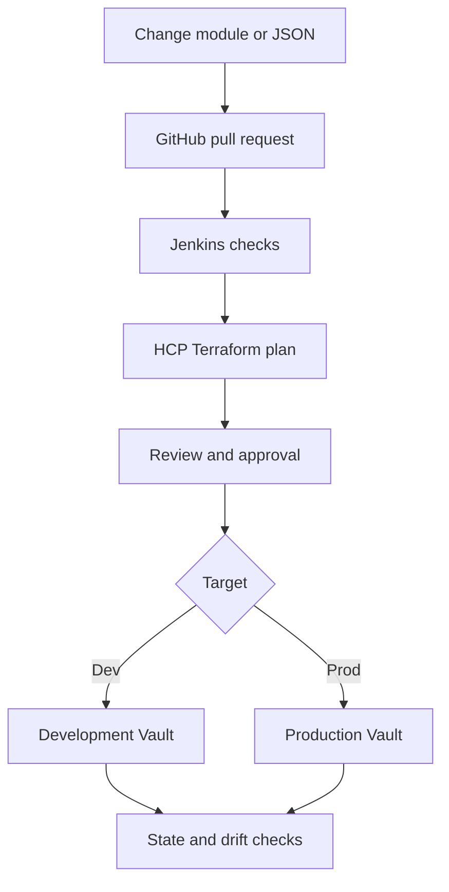
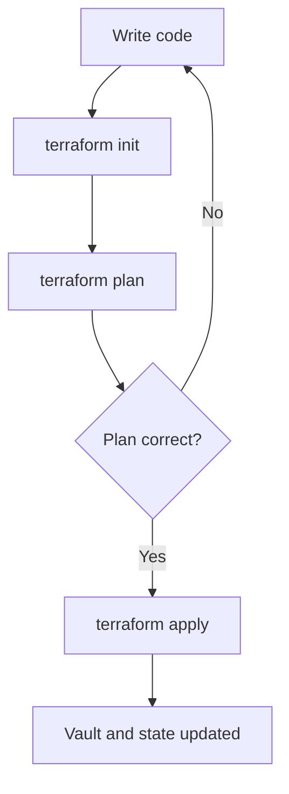
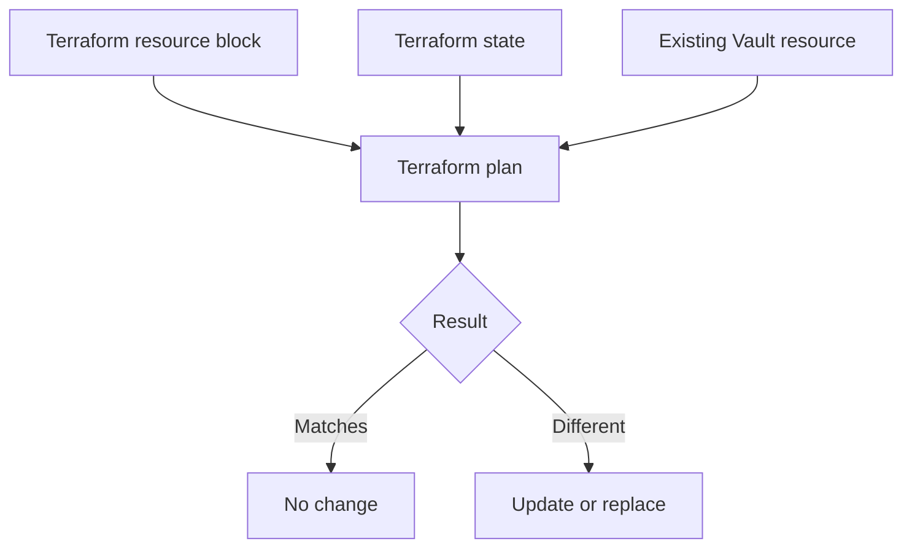

# Nutanix Terraform and Vault Training

<!-- markdownlint-disable MD013 MD024 -->

This guide helps you deliver the training even if you are still learning the
topics yourself.

The training has three sessions. Every session follows the same structure:

1. Definition
2. Trainer hands-on walkthrough
3. Attendee hands-on practice
4. Quiz

Complete [pre-reqs.md](./pre-reqs.md) before starting Session 1.

## What Nutanix wants

Nutanix wants to:

- Stop using manual Vault commands and one-off Python workflows where
  Terraform is a better fit.
- Create new team namespaces and common Vault configuration consistently.
- Use reusable Terraform modules.
- Use a JSON file for simple, non-sensitive team inputs.
- Import existing Vault resources into Terraform state.
- Move from CLI-driven HCP Terraform runs to a GitHub VCS workflow.
- Use Jenkins for validation and security scanning.
- Add approvals, policies, secure Vault access, and drift detection.
- Give other teams approved Terraform patterns without owning all their code.

## What we already know

- Nutanix already uses HCP Terraform.
- Their state is stored in HCP Terraform workspaces.
- Most runs are started from the Terraform CLI.
- Their code is stored and reviewed in GitHub.
- They are moving from CircleCI to Jenkins.
- They have separate development and production Vault clusters.
- They have about 60-65 Vault team namespaces.
- Current Vault automation uses Python and manual operations.
- The Vault resources are not currently imported into Terraform.
- Some attendees know Terraform. Others are newer.
- Development and production are different. A team can exist in development,
  production, or both.

## Training plan

| Session | Topic | Time |
| --- | --- | ---: |
| 1 | Terraform basics and reusable Vault modules | 90 minutes |
| 2 | Import, moved blocks, workspaces, and state | 90 minutes |
| 3 | GitHub, Jenkins, HCP Terraform, security, and drift | 90 minutes |

Each session uses this timing:

| Part | Time |
| --- | ---: |
| Definition | 20 minutes |
| Trainer walkthrough | 30 minutes |
| Attendee practice | 30 minutes |
| Quiz and close | 10 minutes |

## Target workflow



The same approved module can be used in both environments. Development and
production still need separate configuration, workspaces, state, and approvals.

---

## Session 1: Terraform basics and reusable Vault modules

### Goal

By the end of this session, attendees should understand the basic Terraform
workflow and build a small reusable Vault module.

### Part 1: Definition

Explain these terms in simple language:

| Term | Simple definition |
| --- | --- |
| Configuration | Terraform files that describe what we want. |
| Provider | The plugin Terraform uses to call another system, such as Vault. |
| Resource | Something Terraform creates or manages. |
| Data source | Something Terraform reads but does not manage. |
| State | Terraform's record of the real objects it manages. |
| Plan | A preview of the changes Terraform wants to make. |
| Apply | The action that makes the approved changes. |
| Module | Reusable Terraform code. |

Use this explanation:

> We write Terraform configuration. Terraform reads its state and checks the
> real system. The plan shows the difference. We review the plan, and then apply
> only when the proposed change is correct.



Explain the module pattern:

- The module contains the Vault resource pattern.
- The JSON file contains simple team choices.
- The JSON file must not contain passwords, tokens, or secret values.
- `for_each` creates one module instance for each team.
- Validation rejects bad input before apply.
- A template creates consistent Vault policy text.

### Part 2: Trainer hands-on walkthrough

#### Step 1: Start the training Vault server

Use either Podman or Docker. Follow the selected option in
[pre-reqs.md](./pre-reqs.md).

Confirm Vault is ready:

```bash
vault status
```

Expected result:

```text
Initialized     true
Sealed          false
Storage Type    inmem
```

#### Step 2: Create the lab folders

```bash
mkdir -p vault-team-training/modules/team-config/templates
cd vault-team-training
```

The result will look like this:

```text
vault-team-training/
|-- main.tf
|-- outputs.tf
|-- teams.json
|-- versions.tf
`-- modules/
    `-- team-config/
        |-- main.tf
        |-- outputs.tf
        |-- variables.tf
        `-- templates/
            `-- reader-policy.hcl.tftpl
```

#### Step 3: Create `versions.tf`

```hcl
terraform {
  required_version = ">= 1.5.0"

  required_providers {
    vault = {
      source  = "hashicorp/vault"
      version = "~> 5.0"
    }
  }
}

provider "vault" {}
```

For this local lab, the provider reads `VAULT_ADDR` and `VAULT_TOKEN` from the
terminal. Production will use short-lived HCP Terraform credentials.

#### Step 4: Create `teams.json`

```json
{
  "teams": {
    "payments": {
      "enable_kv": true
    }
  }
}
```

#### Step 5: Create root `main.tf`

```hcl
locals {
  team_configuration = jsondecode(file("${path.module}/teams.json"))
  teams              = local.team_configuration.teams
}

module "team_config" {
  source   = "./modules/team-config"
  for_each = local.teams

  team_name = each.key
  enable_kv = try(each.value.enable_kv, true)
}
```

Explain:

- `jsondecode` reads the JSON file.
- `for_each` creates one module instance for each team.
- `each.key` is the team name.
- `try` uses `true` if `enable_kv` is missing.

#### Step 6: Create root `outputs.tf`

```hcl
output "team_mounts" {
  description = "KV mount created for each team."
  value = {
    for team_name, team_module in module.team_config :
    team_name => team_module.mount_path
  }
}
```

#### Step 7: Create module `variables.tf`

Create `modules/team-config/variables.tf`:

```hcl
variable "team_name" {
  description = "Short lowercase team name."
  type        = string

  validation {
    condition     = can(regex("^[a-z][a-z0-9-]{2,30}$", var.team_name))
    error_message = "Use 3-31 lowercase letters, numbers, or hyphens."
  }
}

variable "enable_kv" {
  description = "Create the team's KV v2 secrets engine."
  type        = bool
  default     = true
}
```

#### Step 8: Create the policy template

Create `modules/team-config/templates/reader-policy.hcl.tftpl`:

```hcl
path "${mount_path}/data/*" {
  capabilities = ["read", "list"]
}

path "${mount_path}/metadata/*" {
  capabilities = ["read", "list"]
}
```

#### Step 9: Create module `main.tf`

Create `modules/team-config/main.tf`:

```hcl
terraform {
  required_providers {
    vault = {
      source = "hashicorp/vault"
    }
  }
}

locals {
  mount_path = "${var.team_name}-kv"
}

resource "vault_mount" "team_kv" {
  count = var.enable_kv ? 1 : 0

  path        = local.mount_path
  type        = "kv"
  description = "KV v2 engine for ${var.team_name}"

  options = {
    version = "2"
  }
}

resource "vault_policy" "team_reader" {
  count = var.enable_kv ? 1 : 0

  name = "${var.team_name}-reader"
  policy = templatefile(
    "${path.module}/templates/reader-policy.hcl.tftpl",
    { mount_path = local.mount_path }
  )
}
```

#### Step 10: Create module `outputs.tf`

Create `modules/team-config/outputs.tf`:

```hcl
output "mount_path" {
  description = "Created KV mount path, or null when disabled."
  value       = var.enable_kv ? vault_mount.team_kv[0].path : null
}
```

#### Step 11: Run Terraform

```bash
terraform init
terraform fmt -recursive
terraform validate
terraform plan -out=tfplan
terraform apply tfplan
terraform state list
vault secrets list
vault policy read payments-reader
```

Expected state:

```text
module.team_config["payments"].vault_mount.team_kv[0]
module.team_config["payments"].vault_policy.team_reader[0]
```

### Part 3: Attendee hands-on practice

#### Practice 1: Add a second team

Change `teams.json`:

```json
{
  "teams": {
    "analytics": {
      "enable_kv": true
    },
    "payments": {
      "enable_kv": true
    }
  }
}
```

Run:

```bash
terraform validate
terraform plan
```

Before applying, attendees must explain what Terraform will add.

#### Practice 2: Test the condition

Change this:

```text
"enable_kv": true
```

To this:

```text
"enable_kv": false
```

Run:

```bash
terraform plan
```

Explain why Terraform may propose deleting the existing resources.

Restore the value to `true`.

#### Practice 3: Test validation

Change `analytics` to `Analytics Team` and run:

```bash
terraform plan
```

Terraform should reject the invalid name. Restore `analytics` afterward.

### Part 4: Quiz

1. What does Terraform state contain?
   - A. Vault audit logs
   - B. Mappings between Terraform addresses and real objects
   - C. GitHub passwords
   - D. Only the latest plan
2. What does a data source do?
   - A. Reads information
   - B. Imports a resource
   - C. Approves an apply
   - D. Stores secrets
3. What belongs in `teams.json`?
   - A. Root tokens
   - B. Private keys
   - C. Non-sensitive team settings
   - D. Passwords
4. Why do we use a module?
   - A. To package reusable code
   - B. To replace state
   - C. To skip plan
   - D. To store credentials
5. What must happen before apply?
   - A. Review the plan
   - B. Delete state
   - C. Disable validation
   - D. Add a secret to Git

Answers: 1-B, 2-A, 3-C, 4-A, 5-A.

---

## Session 2: Import, moved blocks, workspaces, and state

### Goal

By the end of this session, attendees should understand how to import one
existing Vault resource safely and how to separate state.

### Part 1: Definition

Explain these terms:

| Term | Simple definition |
| --- | --- |
| Import | Connect an existing object to Terraform state. |
| Import ID | The real object's provider-specific identifier. |
| Resource address | The name Terraform uses for the resource in state. |
| Data source | Read-only lookup. It does not import the object. |
| Moved block | Change the Terraform address without recreating the object. |
| Workspace | A separate HCP Terraform execution and state boundary. |

Use this explanation:

> Import does not move the Vault resource. It tells Terraform that an existing
> Vault resource belongs to a specific Terraform resource address. After the
> import, we must review the first plan carefully.



Important rules:

- Not every provider resource supports import.
- Every supported resource can have a different import ID format.
- Import does not guarantee a clean plan.
- A data source does not manage the resource.
- Do not apply an unexpected deletion or replacement.

### Part 2: Trainer hands-on walkthrough

#### Step 1: Create a Vault resource outside Terraform

Make sure the local training Vault server is running.

```bash
export VAULT_ADDR=http://127.0.0.1:8200
export VAULT_TOKEN=training-root

vault secrets enable -path=legacy-kv kv-v2
vault secrets list
```

The `legacy-kv` mount exists in Vault, but Terraform does not manage it yet.

#### Step 2: Create the import lab

```bash
mkdir vault-import-training
cd vault-import-training
```

Create `main.tf`:

```hcl
terraform {
  required_version = ">= 1.5.0"

  required_providers {
    vault = {
      source  = "hashicorp/vault"
      version = "~> 5.0"
    }
  }
}

provider "vault" {}

resource "vault_mount" "legacy" {
  path        = "legacy-kv"
  type        = "kv"
  description = "Imported legacy KV mount"

  options = {
    version = "2"
  }
}
```

Do not run apply. Without an import, Terraform would try to create a resource
that already exists.

#### Step 3: Import using the CLI

```bash
terraform init
terraform import vault_mount.legacy legacy-kv
terraform state list
terraform state show vault_mount.legacy
terraform plan
```

Explain:

- `vault_mount.legacy` is the Terraform resource address.
- `legacy-kv` is the real Vault mount ID.
- The import changed state.
- The import did not create the resource block.
- The first plan may show a difference.

#### Step 4: Show the import block option

The newer Git-friendly method is:

```hcl
import {
  to = vault_mount.legacy
  id = "legacy-kv"
}
```

Then run:

```bash
terraform plan
terraform apply
```

Do not add this import block after you already imported the same object with the
CLI in the same state. Show it as the alternative method.

Terraform can also generate starting code for supported resources:

```bash
terraform plan -generate-config-out=generated.tf
```

Generated code is only a starting point. It must still be reviewed.

#### Step 5: Explain moved blocks

If the resource is later moved into a module, use a moved block:

```hcl
moved {
  from = vault_mount.legacy
  to   = module.team_config["legacy"].vault_mount.team_kv[0]
}
```

The destination resource must exist in the new module configuration.

Run:

```bash
terraform plan
```

The expected result is an address move without deleting the real Vault mount.
If Terraform proposes a deletion or replacement, stop.

#### Step 6: Explain workspace and state design

Start with these boundaries:

| Workspace | What it manages |
| --- | --- |
| Vault shared platform | Shared root or organization-level Vault configuration |
| Vault development | Development team configuration |
| Vault production | Production team configuration |
| Governance | Shared policies and controls, if ownership is separate |

Do not put all 60-65 namespaces and all shared resources in one state file.
Separate state based on ownership, access, lifecycle, dependencies, and blast
radius.

### Part 3: Attendee hands-on practice

#### Practice 1: Import another mount

Create another resource outside Terraform:

```bash
vault secrets enable -path=practice-kv kv-v2
```

Add this resource block:

```hcl
resource "vault_mount" "practice" {
  path = "practice-kv"
  type = "kv"

  options = {
    version = "2"
  }
}
```

Then run:

```bash
terraform import vault_mount.practice practice-kv
terraform state show vault_mount.practice
terraform plan
```

Attendees must explain the plan before doing anything else.

#### Practice 2: Design the workspaces

Ask attendees where these items should go:

- Shared Vault configuration
- Development team configuration
- Production team configuration
- HCP Terraform governance policies
- Existing team namespaces

Expected answer:

- Shared configuration gets a restricted workspace.
- Development and production use separate state.
- Governance can have separate ownership.
- Existing namespaces are grouped based on ownership and blast radius, not
  automatically placed in one workspace.

### Part 4: Quiz

1. What does import do?
   - A. Recreates the resource
   - B. Connects an existing resource to Terraform state
   - C. Creates a Git branch
   - D. Approves a run
2. What must exist after import?
   - A. Matching Terraform resource configuration
   - B. Only a data source
   - C. A password in Git
   - D. A production token
3. What should you do if the first plan shows an unexpected replacement?
   - A. Apply it
   - B. Delete state
   - C. Stop and fix the configuration
   - D. Ignore it
4. What does a moved block change?
   - A. The Terraform address
   - B. The Vault token
   - C. The Vault server version
   - D. The Git repository
5. Why separate development and production state?
   - A. To separate access, approvals, and blast radius
   - B. To avoid modules
   - C. To remove peer review
   - D. To store secrets

Answers: 1-B, 2-A, 3-C, 4-A, 5-A.

---

## Session 3: GitHub, Jenkins, HCP Terraform, security, and drift

### Goal

By the end of this session, attendees should understand the complete controlled
workflow from a GitHub change to an approved Vault change.

### Part 1: Definition

Explain each layer:

| Layer | Job |
| --- | --- |
| GitHub | Stores code and manages pull-request review. |
| Jenkins | Runs formatting, validation, tests, and security scans. |
| HCP Terraform | Creates plans, applies approved changes, stores state, and records run history. |
| HCP Terraform Agent | Runs Terraform inside the private network. |
| OIDC credentials | Give the Terraform run short-lived Vault authentication. |
| Policy | Checks whether the proposed Terraform change follows rules. |
| Health assessment | Detects Terraform configuration drift. |

Use this explanation:

> The Agent gives HCP Terraform a path to the private Vault API. The Agent is
> not the Vault credential. OIDC gives the run short-lived authentication.

Explain the security controls:

| Control | What it checks |
| --- | --- |
| `terraform fmt` and `validate` | Terraform formatting and basic validity |
| Trivy, Checkov, or Cycode | Static security scan of the Terraform code |
| Run task | External service check during an HCP Terraform run |
| Sentinel, OPA, or HCP Terraform policy | Terraform plan and metadata rules |
| Vault EGP or RGP | Vault API request rules |
| Health assessment | Drift after deployment |

These tools are not the same. They protect different parts of the workflow.

### Part 2: Trainer hands-on walkthrough

#### Step 1: Show the repository design

```text
vault-platform/
|-- modules/
|   `-- team-config/
|-- live/
|   |-- dev/
|   |   |-- main.tf
|   |   `-- teams.json
|   `-- prod/
|       |-- main.tf
|       `-- teams.json
`-- Jenkinsfile
```

Explain:

- `modules` contains reusable code.
- `live/dev` contains development input.
- `live/prod` contains production input.
- Development and production can use the same module version.
- A team does not have to exist in both environments.

#### Step 2: Show the Jenkins checks

Example `Jenkinsfile`:

```groovy
pipeline {
  agent any

  stages {
    stage('Terraform format') {
      steps {
        sh 'terraform fmt -check -recursive'
      }
    }

    stage('Terraform validate') {
      steps {
        sh 'terraform -chdir=live/dev init -backend=false'
        sh 'terraform -chdir=live/dev validate'
      }
    }

    stage('Terraform security scan') {
      steps {
        sh 'trivy config --exit-code 1 --severity HIGH,CRITICAL .'
      }
    }
  }
}
```

Checkov alternative:

```bash
checkov -d . --framework terraform --compact
```

Harbor can scan container images. That does not automatically mean it scans
Terraform code in the GitHub pull request. The selected IaC scanner must be
added to Jenkins.

#### Step 3: Show the HCP Terraform workspace setup

For the development pilot:

1. Open the correct HCP Terraform organization.
2. Select or create the Vault Development project.
3. Create `vault-team-pilot-dev`.
4. Connect the GitHub repository.
5. Set the working directory to `live/dev`.
6. Select Agent execution mode.
7. Select the approved Agent pool.
8. Disable auto-apply.
9. Pin the Terraform version.
10. Add the correct team permissions.
11. Add Vault dynamic credential settings.
12. Add required policies and run tasks.
13. Enable health assessments after the first successful apply.

#### Step 4: Explain Vault dynamic credentials

Example HCP Terraform environment variables:

```text
TFC_VAULT_PROVIDER_AUTH=true
TFC_VAULT_ADDR=https://vault.example.com:8200
TFC_VAULT_RUN_ROLE=vault-team-pilot
TFC_VAULT_NAMESPACE=nutanix
```

For separate plan and apply roles:

```text
TFC_VAULT_PLAN_ROLE=vault-team-pilot-plan
TFC_VAULT_APPLY_ROLE=vault-team-pilot-apply
```

Provider configuration:

```hcl
provider "vault" {}
```

Do not store a permanent Vault token in Git or a normal workspace variable.
A Vault specialist must review the OIDC issuer, audience, claims, roles,
policies, token lifetime, namespace, and CA trust.

#### Step 5: Walk through one change

1. Change one value in `live/dev/teams.json`.
2. Create a GitHub pull request.
3. Jenkins runs formatting, validation, and scanning.
4. HCP Terraform creates a speculative plan.
5. A peer reviews the code and plan.
6. Merge the pull request.
7. HCP Terraform creates the real workspace plan.
8. Policies and run tasks check the run.
9. An approved person confirms apply.
10. The Agent runs Terraform and reaches Vault.
11. OIDC gives the run short-lived Vault access.
12. HCP Terraform updates state and saves the run history.

#### Step 6: Show drift detection

Only use development:

1. Apply one Vault resource through HCP Terraform.
2. Change that resource manually in Vault.
3. Open the workspace Health page.
4. Run or wait for a health assessment.
5. Review the detected drift.
6. Choose one response:
   - Reject the manual change and apply Terraform to restore the code value.
   - Accept the manual change by updating Git and applying the reviewed change.

Drift detection does not automatically repair the resource.

#### Step 7: Explain shared governance

The central team should not own every other team's Terraform code.

| Central platform team | Consumer team |
| --- | --- |
| Publishes approved modules | Uses approved modules |
| Defines workspace standards | Owns its workspace inputs |
| Defines policy sets | Owns its pull requests |
| Defines identity and access standards | Owns its deployment results |
| Defines Agent and credential patterns | Fixes its failed plans and drift |
| Reviews audit and governance information | Operates within the guardrails |

Start policies in advisory mode. Test them and create an exception process
before making them mandatory.

#### Step 8: Explain Infragraph

Use this short explanation:

> Infragraph gives visibility into supported infrastructure resources and their
> relationships.

Do not say it replaces Terraform drift detection or security scanning. Confirm
the customer's access, supported connections, and current product availability
before showing it.

### Part 3: Attendee hands-on practice

#### Practice 1: Put the workflow in order

Give attendees these steps in a mixed order:

- Authorized apply approval
- GitHub pull request
- HCP Terraform workspace plan
- Jenkins checks
- Agent execution with OIDC
- Peer review and merge
- Speculative plan
- State update and health assessment

Correct order:

1. GitHub pull request
2. Jenkins checks
3. Speculative plan
4. Peer review and merge
5. HCP Terraform workspace plan
6. Authorized apply approval
7. Agent execution with OIDC
8. State update and health assessment

#### Practice 2: Choose the correct control

| Requirement | Correct control |
| --- | --- |
| Check Terraform syntax | `terraform validate` |
| Scan Terraform code | Trivy, Checkov, or Cycode |
| Require an approved module | Sentinel, OPA, or HCP Terraform policy |
| Restrict a Vault API operation | Vault EGP or RGP |
| Reach private Vault | HCP Terraform Agent |
| Authenticate without a permanent token | OIDC dynamic credentials |
| Find a manual change | Health assessment |

#### Practice 3: Terraform or operational job?

| Activity | Correct answer |
| --- | --- |
| Ensure a namespace exists | Terraform |
| Define an ACL policy | Terraform |
| Delete inactive identities on a schedule | Operational job |
| Run upgrade tests | Operational job |
| Configure a secrets engine | Terraform |
| Perform a one-time data migration | Operational job |

### Part 4: Quiz

1. What starts a speculative plan?
   - A. A change in a connected pull request
   - B. Vault token expiration
   - C. State deletion
   - D. An Infragraph query
2. What does the Agent provide?
   - A. A permanent Vault token
   - B. Private execution and network access
   - C. GitHub approval
   - D. Vault policy code
3. What gives the run short-lived Vault authentication?
   - A. OIDC dynamic credentials
   - B. Jenkins logs
   - C. Infragraph
   - D. A moved block
4. What does a health assessment do?
   - A. Detects drift and check failures
   - B. Fixes every manual change automatically
   - C. Creates a Vault cluster
   - D. Publishes a module
5. Who should own a consumer team's deployment?
   - A. The consumer team within central guardrails
   - B. The central team in every case
   - C. The scanner vendor
   - D. The Vault root token owner

Answers: 1-A, 2-B, 3-A, 4-A, 5-A.

---

## What to do after the training

Run one development pilot:

1. Select one new or existing team namespace.
2. List the Vault resources included in the pilot.
3. Build and review the reusable module.
4. Create the development JSON input.
5. Add Jenkins validation and scanning.
6. Create the VCS-connected development workspace.
7. Configure the Agent and OIDC.
8. Import one existing resource type at a time, if needed.
9. Review every first plan.
10. Apply only after approval.
11. Create and detect one controlled drift event.
12. Document what worked before expanding.

## Pilot success checklist

- [ ] One person can add a team through reviewed JSON input.
- [ ] The module creates consistent Vault resources.
- [ ] The workspace manages only the intended resources.
- [ ] The plan has no unexpected deletion or replacement.
- [ ] Jenkins checks pass.
- [ ] HCP Terraform policies and approvals work.
- [ ] The Agent reaches Vault without making Vault public.
- [ ] HCP Terraform uses short-lived Vault credentials.
- [ ] State is stored and protected in HCP Terraform.
- [ ] A controlled manual change is detected as drift.
- [ ] Operational jobs remain outside Terraform.
- [ ] Owners and approvers are documented.

## Things you must not say

Do not say:

- Every Terraform resource supports import.
- Import guarantees a clean plan.
- A data source imports a resource.
- A module knows the existing infrastructure.
- The Agent provides the Vault credential.
- Run tasks promote development to production.
- Infragraph fixes drift.
- Harbor automatically scans Terraform code.
- All namespaces should use one state file.
- Every Vault operation should use Terraform.

If you do not know a Vault security answer, say:

> I need to confirm that with the Vault specialist. I do not want to guess about
> a security-sensitive configuration.

## Official references

- [Terraform overview](https://developer.hashicorp.com/terraform/intro)
- [HCP Terraform](https://developer.hashicorp.com/terraform/cloud-docs)
- [Terraform import](https://developer.hashicorp.com/terraform/language/import)
- [Generated import configuration](https://developer.hashicorp.com/terraform/language/import/generating-configuration)
- [Vault Terraform provider tutorial](https://developer.hashicorp.com/vault/tutorials/get-started/learn-terraform)
- [Manage Vault with Terraform](https://developer.hashicorp.com/vault/docs/configuration/programmatic-management)
- [HCP Terraform Vault dynamic credentials](https://developer.hashicorp.com/terraform/cloud-docs/dynamic-provider-credentials/vault-configuration)
- [HCP Terraform health assessments](https://developer.hashicorp.com/terraform/cloud-docs/workspaces/health)
- [HCP Terraform run tasks](https://developer.hashicorp.com/terraform/cloud-docs/workspaces/settings/run-tasks)
- [HCP Terraform private registry](https://developer.hashicorp.com/terraform/cloud-docs/registry)
- [HCP Terraform project best practices](https://developer.hashicorp.com/terraform/cloud-docs/projects/best-practices)
- [Infragraph](https://developer.hashicorp.com/hcp/docs/infragraph)
