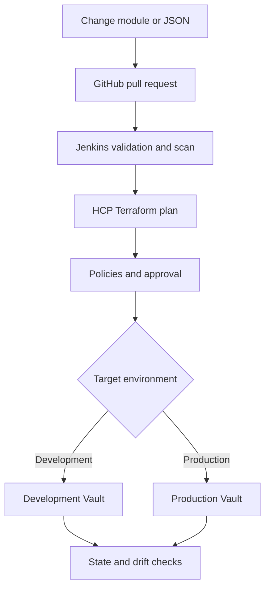

# Nutanix Terraform and Vault Workshop Series

<!-- markdownlint-disable MD013 MD024 -->

This is the landing page for the three-day workshop series. Start with the
prerequisites, then open the workshop for the day you are attending.

## Start here

1. Complete the [prerequisites and readiness checks](./pre-reqs.md).
2. Use the [presenter script](./presenter-script.md) during the live sessions.
3. Open [Workshop 1: Terraform Foundations and Vault Enterprise Codification](./workshop-1.md).
4. Open [Workshop 2: Import, Moved Blocks, Workspaces, and State](./workshop-2.md).
5. Open [Workshop 3: GitHub, Jenkins, HCP Terraform, Security, and Drift](./workshop-3.md).

The presenter script contains the short words to say, actions to perform,
expected results, questions, transitions, safety stops, and troubleshooting.
The workshop files contain the complete technical detail and examples.

## Series outcome

The goal is to move from Terraform foundations to one governed Vault automation
pilot. By the end of the series, the team should understand how to:

- Use the Vault provider to manage supported configuration in an existing Vault
  environment.
- Package repeatable Vault configuration in reusable Terraform modules.
- Codify Vault Enterprise namespaces, policies, auth methods, and secrets
  engines with the Vault provider.
- Use non-sensitive JSON input, validation, loops, templates, and outputs.
- Adopt existing Vault resources with import and review the first plan safely.
- Separate HCP Terraform projects, workspaces, state, access, and blast radius.
- Run changes through GitHub, Jenkins checks, HCP Terraform plans, approvals,
  Agents, and short-lived Vault credentials.
- Apply security controls, detect drift, publish approved modules, and delegate
  access without removing Vault's own authorization controls.

This series does not deploy a production Vault cluster and does not migrate all
existing namespaces. It builds and validates the pattern in development first.
Workshop 1 includes a 20-minute guided Vault Enterprise codification extension.

## Workshop timeline

Each workshop is two hours. It has two focused 55-minute blocks with a
10-minute break. Participants can attend the blocks relevant to them, but later
blocks assume the earlier concepts are understood.

### Day 1: Workshop 1

| Time | Block | Topics |
| --- | --- | --- |
| 0:00-0:55 | Terraform foundations | Configuration, providers, provider versions, resources, data sources, state, plan, apply, and modules |
| 0:55-1:05 | Break | 10-minute break |
| 1:05-2:00 | Vault automation and Enterprise extension | 30-minute reusable module walkthrough, 20-minute Vault Enterprise codification walkthrough, and 5-minute recap |

**Outcome:** A working development example that creates a team KV v2 secrets
engine and reader policy through a reusable module. Attendees also understand
how the same provider manages Enterprise namespaces, policies, auth methods,
secrets engines, and write-only credential flows.

[Open Workshop 1](./workshop-1.md)

### Day 2: Workshop 2

| Time | Block | Topics |
| --- | --- | --- |
| 0:00-0:55 | Adopt existing resources | Import IDs, CLI import, import blocks, generated configuration, data sources, and first-plan review |
| 0:55-1:05 | Break | 10-minute break |
| 1:05-2:00 | Refactor and isolate safely | Moved blocks, module refactoring, projects, workspaces, state boundaries, access, lifecycle, and blast radius |

**Outcome:** One existing development Vault resource is safely connected to
Terraform state and can be refactored without recreating it.

[Open Workshop 2](./workshop-2.md)

### Day 3: Workshop 3

| Time | Block | Topics |
| --- | --- | --- |
| 0:00-0:55 | Delivery and execution | GitHub pull requests, Jenkins checks, HCP Terraform workspaces, speculative plans, approvals, Agents, and OIDC |
| 0:55-1:05 | Break | 10-minute break |
| 1:05-2:00 | Guardrails and operating model | Scanning, Sentinel or OPA, run tasks, Vault EGP or RGP, drift, private registry, RBAC, governance, and Infragraph |

**Outcome:** A documented operating model for a controlled development pilot
with one authoritative plan and apply path.

[Open Workshop 3](./workshop-3.md)

## Prerequisites

Complete these items before Workshop 1:

- A supported Linux VM or workstation. Linux is preferred for a consistent lab
  experience. macOS or Windows is acceptable only after the readiness check
  validates the commands.
- Terraform CLI 1.5 or later.
- Vault CLI.
- Git.
- One container runtime: Podman or Docker.
- An editor and terminal access.
- Access to the required HCP Terraform organization and development workspace.
- Access to the training GitHub repository and Jenkins job.
- Network connectivity to HCP Terraform, GitHub, Jenkins, the development Vault
  API, and the required container registry.
- Permission to use the approved HCP Terraform Agent pool and development Vault
  authentication path for Workshop 3.
- No production Vault tokens, customer secrets, private keys, or passwords in
  Git, Terraform variables, JSON files, screenshots, or workshop notes.

The optional live Enterprise extension has additional requirements:

- Terraform CLI 1.11 or later for the ephemeral and write-only examples.
- Vault provider 5.0 or later.
- Vault Enterprise Standard for namespaces.
- Vault Enterprise Advanced Data Protection for the Transform secrets engine.
- A development license and disposable Vault Enterprise environment.

If those requirements are unavailable, the Enterprise section remains an
instructor-led code and architecture walkthrough.

Run a mandatory technical readiness check a few days before the training.
Confirm the operating system, tool versions, account permissions, container
startup, port 8200 availability, and every required network path.

[Open the detailed prerequisites and readiness checklist](./pre-reqs.md)

## Workshop format

Each workshop contains:

1. Definitions in plain language.
2. A trainer walkthrough.
3. Attendee hands-on practice.
4. A short quiz and questions.

Anyone joining Workshop 2 or Workshop 3 without attending the earlier material
should review the earlier workshop guide or recording first.

## Target workflow

A team changes approved Terraform code or non-sensitive configuration in GitHub.
Jenkins validates and scans it. HCP Terraform produces the authoritative plan.
After policy checks and human approval, HCP Terraform applies the change through
an Agent with short-lived Vault credentials.

Development and production use separate configuration, workspaces, state,
permissions, and approval paths. Jenkins and HCP Terraform must not perform
independent applies against the same resources.
