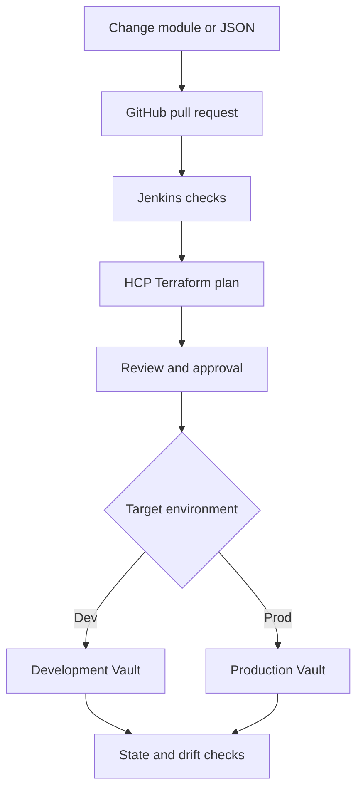
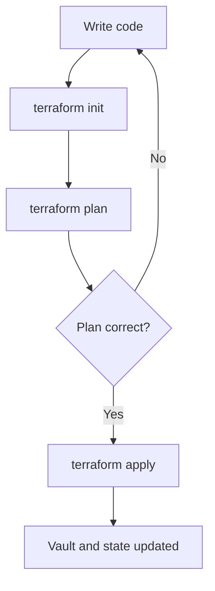
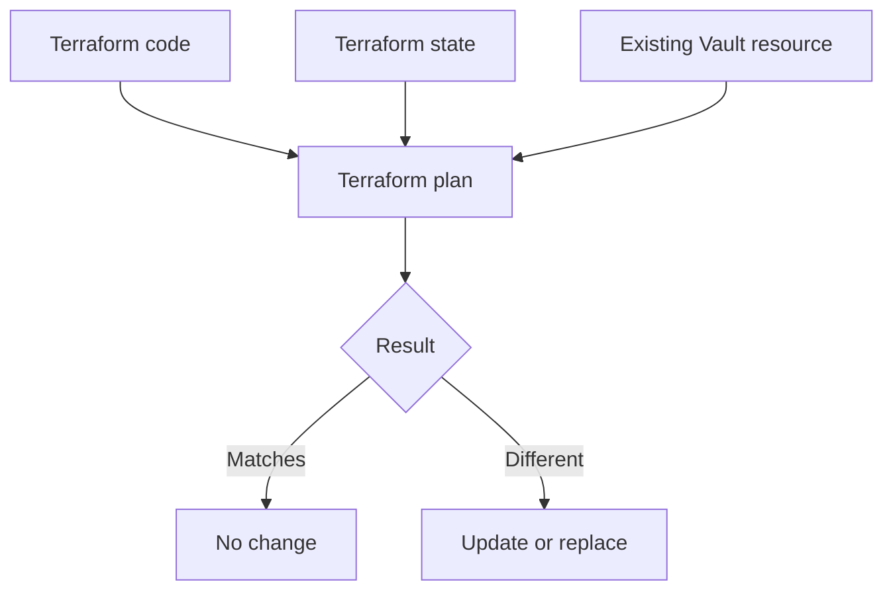

# Nutanix Terraform and Vault Training

<!-- markdownlint-disable MD013 MD024 MD025 -->

This is your trainer script. The words under **Read aloud** are the words you
can say to the customer. The steps under **On screen** are the actions you take.

Complete [pre-reqs.md](./pre-reqs.md) before the first session.

## Training plan

| Session | Topic | Time |
| --- | --- | ---: |
| 1 | Terraform basics and reusable Vault modules | 90 minutes |
| 2 | Import, moved blocks, workspaces, and state | 90 minutes |
| 3 | GitHub, Jenkins, HCP Terraform, security, and drift | 90 minutes |

Each session has four parts:

1. Definition
2. Trainer hands-on walkthrough
3. Attendee hands-on practice
4. Quiz

## Opening speaker notes

### Read aloud

> Good morning, everyone. Thank you for joining.
>
> We already know that your team uses HCP Terraform, GitHub, and HCP Terraform
> workspaces. We also know that most runs are started from the Terraform CLI
> today.
>
> Your main goal is to make Vault management easier and more consistent. You
> want to use reusable Terraform modules, simple JSON input, GitHub review,
> Jenkins checks, HCP Terraform approvals, secure Vault access, and drift
> detection.
>
> We are not going to import all 60 or more Vault namespaces during this
> training. That would be unsafe and too large. We will use one small
> development example. After the pattern works, you can expand it carefully.
>
> We will have three sessions. Each session starts with the basic idea. I will
> then show the process. You will practice it, and we will finish with a short
> quiz.

## The final workflow

### Read aloud

> This is the workflow we are working toward.
>
> A team updates the approved Terraform module or the JSON configuration. They
> create a GitHub pull request. Jenkins checks the code. HCP Terraform creates a
> plan. A person reviews and approves the change. HCP Terraform then uses an
> Agent and short-lived Vault credentials to make the approved change.
>
> Development and production do not need to be identical. A team can exist in
> development, production, or both. The same module can be used, but each
> environment should have its own configuration, workspace, state, and
> approval process.



---

# Session 1: Terraform Basics and Reusable Vault Modules

## Session 1 goal

### Read aloud

> Today we will review the basic Terraform workflow. Then we will build a small
> reusable module that creates a Vault KV secrets engine and a Vault policy.
>
> We will use a JSON file to add teams. The JSON file will contain only simple,
> non-sensitive settings. It will never contain passwords, Vault tokens,
> private keys, or secret values.

## Part 1: Definition

### Configuration

### Read aloud

> Terraform configuration is the code that describes what we want.
>
> For example, our configuration may say that the payments team needs a KV
> secrets engine and a read policy.

### Provider

### Read aloud

> A provider is the plugin Terraform uses to communicate with another system.
>
> In this training, Terraform uses the Vault provider to call the Vault API.

### Provider documentation and versions

### Read aloud

> The provider documentation shows the resources and data sources that the
> provider supports.
>
> We must check the documentation for the provider version we use. If a new
> service or feature is not supported by that version, Terraform cannot manage
> it through that provider yet.

### Resource

### Read aloud

> A resource is something Terraform creates or manages.
>
> A Vault namespace, policy, secrets engine, or auth method can be a Terraform
> resource when the Vault provider supports it.

### Data source

### Read aloud

> A data source reads information that already exists.
>
> A data source does not import that object. It also does not make Terraform the
> owner of that object.

### State

### Read aloud

> Terraform state is Terraform's record of the objects it manages.
>
> State connects a Terraform resource address to a real object in Vault. The
> state is not the Terraform code, and it is not a Vault backup.

### Plan and apply

### Read aloud

> Terraform plan shows what Terraform wants to change. Terraform apply makes
> the approved change.
>
> We always read the plan before apply. If the plan shows an unexpected deletion
> or replacement, we stop and fix the problem.

### Module

### Read aloud

> A module is reusable Terraform code.
>
> We can build one standard team module and use it many times. This helps every
> team receive the same basic Vault configuration.
>
> The module does not know the existing infrastructure by itself. Terraform
> uses the provider and state to understand managed objects.

### Provider and module together

### Read aloud

> A provider connects Terraform to a system and its API. A module packages
> reusable Terraform code.
>
> The resources inside a module still use a provider. A module does not replace
> the provider.

### Terraform workflow

### Read aloud

> First, we write the Terraform code. Next, Terraform initializes the working
> directory. Then Terraform creates a plan. We review the plan. If it is correct,
> we apply it. Terraform updates the real system and its state.



## Part 2: Trainer hands-on walkthrough

## Step 1: Start the local Vault server

### Read aloud

> I am using a local Vault development server. This server is only for
> training. It runs in memory, starts unsealed, and loses its data when the
> container stops.
>
> This is not a production Vault design.

### On screen

Start Vault by following the Podman or Docker option in
[pre-reqs.md](./pre-reqs.md).

Then run:

```bash
export VAULT_ADDR=http://127.0.0.1:8200
export VAULT_TOKEN=training-root
vault status
```

### Expected result

```text
Initialized     true
Sealed          false
Storage Type    inmem
```

### Read aloud

> Vault is initialized and unsealed. The storage type is in-memory. That tells
> us this is the disposable training server.

## Step 2: Create the folders

### On screen

```bash
mkdir -p vault-team-training/modules/team-config/templates
cd vault-team-training
```

The folder structure will be:

```text
vault-team-training/
|-- main.tf
|-- outputs.tf
|-- teams.json
|-- versions.tf
`-- modules/
    `-- team-config/
        |-- main.tf
        |-- outputs.tf
        |-- variables.tf
        `-- templates/
            `-- reader-policy.hcl.tftpl
```

### Read aloud

> The files at the top are the root module. The folder under `modules` is the
> reusable child module.
>
> The root module reads the team input. The child module contains the standard
> Vault resources.

## Step 3: Create `versions.tf`

### On screen

```hcl
terraform {
  required_version = ">= 1.5.0"

  required_providers {
    vault = {
      source  = "hashicorp/vault"
      version = "~> 5.0"
    }
  }
}

provider "vault" {}
```

### Read aloud

> This file requires Terraform 1.5 or later. It also tells Terraform to download
> the HashiCorp Vault provider.
>
> The provider block is empty because the local lab reads the Vault address and
> token from the terminal environment variables.
>
> Later, HCP Terraform will use short-lived credentials instead of a permanent
> token.

## Step 4: Create `teams.json`

### On screen

```json
{
  "teams": {
    "payments": {
      "enable_kv": true
    }
  }
}
```

### Read aloud

> This JSON file contains one team named payments.
>
> The value `enable_kv` is true, so Terraform will create a KV secrets engine
> for this team.
>
> The file contains no secrets. It only contains configuration choices.

## Step 5: Create root `main.tf`

### On screen

```hcl
locals {
  team_configuration = jsondecode(file("${path.module}/teams.json"))
  teams              = local.team_configuration.teams
}

module "team_config" {
  source   = "./modules/team-config"
  for_each = local.teams

  team_name = each.key
  enable_kv = try(each.value.enable_kv, true)
}
```

### Read aloud

> Terraform reads `teams.json` and converts it into data Terraform can use.
>
> `for_each` creates one copy of the team module for every team in the JSON
> file.
>
> `each.key` is the team name. In this example, the team name is payments.
>
> If `enable_kv` is missing, Terraform uses true as the default.

## Step 6: Create root `outputs.tf`

### On screen

```hcl
output "team_mounts" {
  description = "KV mount created for each team."
  value = {
    for team_name, team_module in module.team_config :
    team_name => team_module.mount_path
  }
}
```

### Read aloud

> This output shows the KV mount created for each team. Outputs give us useful
> information after the plan or apply.

## Step 7: Create module `variables.tf`

### On screen

Create `modules/team-config/variables.tf`:

```hcl
variable "team_name" {
  description = "Short lowercase team name."
  type        = string

  validation {
    condition     = can(regex("^[a-z][a-z0-9-]{2,30}$", var.team_name))
    error_message = "Use 3-31 lowercase letters, numbers, or hyphens."
  }
}

variable "enable_kv" {
  description = "Create the team's KV v2 secrets engine."
  type        = bool
  default     = true
}
```

### Read aloud

> These are the inputs accepted by the module.
>
> The team name must use lowercase letters, numbers, or hyphens. Terraform will
> reject an invalid team name before apply.
>
> `enable_kv` is a true or false choice. Its default value is true.

## Step 8: Create the policy template

### On screen

Create `modules/team-config/templates/reader-policy.hcl.tftpl`:

```hcl
path "${mount_path}/data/*" {
  capabilities = ["read", "list"]
}

path "${mount_path}/metadata/*" {
  capabilities = ["read", "list"]
}
```

### Read aloud

> This template creates the same policy structure for every team.
>
> Terraform replaces `mount_path` with the correct team KV path.

## Step 9: Create module `main.tf`

### On screen

Create `modules/team-config/main.tf`:

```hcl
terraform {
  required_providers {
    vault = {
      source = "hashicorp/vault"
    }
  }
}

locals {
  mount_path = "${var.team_name}-kv"
}

resource "vault_mount" "team_kv" {
  count = var.enable_kv ? 1 : 0

  path        = local.mount_path
  type        = "kv"
  description = "KV v2 engine for ${var.team_name}"

  options = {
    version = "2"
  }
}

resource "vault_policy" "team_reader" {
  count = var.enable_kv ? 1 : 0

  name = "${var.team_name}-reader"
  policy = templatefile(
    "${path.module}/templates/reader-policy.hcl.tftpl",
    { mount_path = local.mount_path }
  )
}
```

### Read aloud

> The local value builds a mount path from the team name. The payments team gets
> a path named `payments-kv`.
>
> The `count` condition creates the resources when `enable_kv` is true. When it
> is false, the count becomes zero.
>
> The first resource creates the KV secrets engine. The second resource creates
> the reader policy from the template.

## Step 10: Create module `outputs.tf`

### On screen

Create `modules/team-config/outputs.tf`:

```hcl
output "mount_path" {
  description = "Created KV mount path, or null when disabled."
  value       = var.enable_kv ? vault_mount.team_kv[0].path : null
}
```

### Read aloud

> The child module returns the mount path to the root module. If KV is disabled,
> the output is null.

## Step 11: Run Terraform

### On screen

```bash
terraform init
```

### Read aloud

> Terraform initialized the folder and downloaded the Vault provider.

### On screen

```bash
terraform fmt -recursive
terraform validate
```

### Read aloud

> Formatting makes the code consistent. Validation checks that the Terraform
> configuration is valid.

### On screen

```bash
terraform plan -out=tfplan
```

### Read aloud

> The plan should show one KV mount and one policy being created for the
> payments team.
>
> We read the plan before applying it. We are looking for unexpected changes,
> especially deletion or replacement.

### On screen

```bash
terraform apply tfplan
terraform state list
vault secrets list
vault policy read payments-reader
```

### Expected Terraform state

```text
module.team_config["payments"].vault_mount.team_kv[0]
module.team_config["payments"].vault_policy.team_reader[0]
```

### Read aloud

> Terraform created the Vault resources and recorded them in state.
>
> The state address shows the payments module, the Vault resource type, the
> resource name, and the count index.

## Part 3: Attendee hands-on practice

## Practice 1: Add a second team

### Read aloud

> Now you will add a second team named analytics. Do not apply immediately.
> First, run a plan and tell us what Terraform wants to add.

### On screen

Change `teams.json` to:

```json
{
  "teams": {
    "analytics": {
      "enable_kv": true
    },
    "payments": {
      "enable_kv": true
    }
  }
}
```

Run:

```bash
terraform validate
terraform plan
```

### Correct result

- Terraform keeps the payments resources.
- Terraform adds an analytics KV mount.
- Terraform adds an analytics reader policy.

## Practice 2: Test the condition

### Read aloud

> Change `analytics.enable_kv` from true to false. Run a plan. Do not apply.
> Tell us why Terraform wants to remove the analytics resources.

### On screen

```text
"enable_kv": false
```

Run:

```bash
terraform plan
```

### Read aloud

> The condition changed the resource count from one to zero. Terraform now
> believes the analytics KV mount and policy should not exist.
>
> This is why a small JSON change still needs a full plan review.

Restore the value to true.

## Practice 3: Test validation

### Read aloud

> Change the analytics team name to `Analytics Team` and run a plan. The name is
> invalid because it contains uppercase letters and a space.

### On screen

```bash
terraform plan
```

### Correct result

Terraform rejects the input and shows this message:

```text
Use 3-31 lowercase letters, numbers, or hyphens.
```

Restore the team name to `analytics`.

## Part 4: Quiz

### Read aloud

> We will finish with five short questions. Choose the best answer.

1. What does Terraform state contain?
   - A. Vault audit logs
   - B. Mappings between Terraform addresses and real objects
   - C. GitHub passwords
   - D. Only the latest plan
2. What does a data source do?
   - A. Reads information
   - B. Imports a resource
   - C. Approves an apply
   - D. Stores secrets
3. What belongs in `teams.json`?
   - A. Root tokens
   - B. Private keys
   - C. Non-sensitive team settings
   - D. Passwords
4. Why do we use a module?
   - A. To package reusable code
   - B. To replace state
   - C. To skip plan
   - D. To store credentials
5. What must happen before apply?
   - A. Review the plan
   - B. Delete state
   - C. Disable validation
   - D. Add a secret to Git

### Answer key

1. B
2. A
3. C
4. A
5. A

## Session 1 closing notes

### Read aloud

> Today we reviewed the Terraform lifecycle and built a reusable Vault module.
> We used JSON input, `for_each`, a condition, input validation, and a policy
> template.
>
> In the next session, we will connect an existing Vault resource to Terraform
> state and move it into a better code structure.

### On screen after the session

Remove the disposable Session 1 resources:

```bash
terraform destroy
```

Stop the Vault container by following the cleanup command for your selected
runtime in [pre-reqs.md](./pre-reqs.md).

---

# Session 2: Import, Moved Blocks, Workspaces, and State

## Session 2 goal

### Read aloud

> Today we will work with a Vault resource that already exists.
>
> We will import it into Terraform state, review the first plan, and discuss how
> to move resources into modules without recreating them.
>
> We will also discuss workspace and state boundaries. We do not want all Vault
> resources placed in one large state file.

## Part 1: Definition

### Import

### Read aloud

> Import connects an existing real object to a Terraform resource address in
> state.
>
> Import does not move the real object. It does not recreate it. It does not
> automatically create perfect Terraform code.

### Resource address and import ID

### Read aloud

> The resource address is the name Terraform uses in configuration and state.
> An example is `vault_mount.legacy`.
>
> The import ID identifies the real object. An example is the Vault mount path
> `legacy-kv`.
>
> The provider documentation tells us the correct import ID for each resource.
> Not every Terraform resource supports import.

### First plan after import

### Read aloud

> After import, Terraform compares three things: our code, the state mapping,
> and the real Vault resource.
>
> The first plan may show no change, an update, or a replacement. Import does
> not guarantee a clean plan.
>
> If the plan shows an unexpected change, we stop. We fix the configuration
> before apply.



### Data source

### Read aloud

> A data source reads an existing object. It does not import the object and does
> not give Terraform ownership of it.
>
> We use a data source when we need information. We use import when Terraform
> must manage the object's lifecycle.

### Moved block

### Read aloud

> A moved block changes the Terraform address of a managed resource.
>
> We use it when we move a resource into a module or rename its Terraform
> address. A correct moved block does not recreate the real object.

### Workspace and state

### Read aloud

> An HCP Terraform workspace is an execution and state boundary.
>
> A workspace is not only a folder. It has its own runs, state, variables,
> permissions, and settings.
>
> An HCP Terraform project groups related workspaces and helps us manage access
> to those workspaces.
>
> We separate workspaces based on ownership, environment, access, lifecycle,
> dependencies, and blast radius.
>
> We should not put every shared resource and all 60 or more team namespaces in
> one state file. One mistake could affect too many resources.

## Part 2: Trainer hands-on walkthrough

## Step 1: Start the local Vault server

### On screen

Start Vault by following the Podman or Docker option in
[pre-reqs.md](./pre-reqs.md).

Then run:

```bash
export VAULT_ADDR=http://127.0.0.1:8200
export VAULT_TOKEN=training-root
vault status
```

### Read aloud

> This is a new disposable Vault server for Session 2. It is initialized,
> unsealed, and running only on my local machine.

## Step 2: Create an unmanaged Vault mount

### Read aloud

> First, I will create a Vault secrets engine outside Terraform. This represents
> an existing Vault resource that was created by a script or manual command.

### On screen

```bash
vault secrets enable -path=legacy-kv kv-v2
vault secrets list
```

### Read aloud

> The `legacy-kv` mount exists in Vault. Terraform does not know about it yet
> because it is not in Terraform state.

## Step 3: Create the import folder

### On screen

```bash
mkdir vault-import-training
cd vault-import-training
```

Create `main.tf`:

```hcl
terraform {
  required_version = ">= 1.5.0"

  required_providers {
    vault = {
      source  = "hashicorp/vault"
      version = "~> 5.0"
    }
  }
}

provider "vault" {}

resource "vault_mount" "legacy" {
  path        = "legacy-kv"
  type        = "kv"
  description = "Imported legacy KV mount"

  options = {
    version = "2"
  }
}
```

### Read aloud

> This resource block describes how Terraform should manage the existing
> `legacy-kv` mount.
>
> I will not run apply yet. If I run apply before import, Terraform will try to
> create a resource at a path that already exists.

## Step 4: Run the CLI import

### On screen

```bash
terraform init
terraform import vault_mount.legacy legacy-kv
```

### Read aloud

> `vault_mount.legacy` is the Terraform resource address.
>
> `legacy-kv` is the ID of the existing Vault mount.
>
> Terraform has now connected the resource address to the real mount in state.
> It did not create a second Vault mount.

### On screen

```bash
terraform state list
terraform state show vault_mount.legacy
terraform plan
```

### Read aloud

> The state now contains `vault_mount.legacy`.
>
> The first plan compares our code with the existing mount. It may show a
> difference because our code includes a description that the existing mount
> may not have.
>
> We do not apply until we understand every difference.

## Step 5: Show the import block method

### Read aloud

> The CLI import changes state immediately. Terraform also has a declarative
> import block.
>
> The import block can be stored in Git, reviewed in a pull request, and shown
> in a Terraform plan. This fits the target GitOps workflow better.

### On screen

```hcl
import {
  to = vault_mount.legacy
  id = "legacy-kv"
}
```

### Read aloud

> `to` is the Terraform resource address. `id` is the existing Vault object ID.
>
> In a clean state, we would run plan and apply to complete this import.
>
> We will not add this block to the same state after already completing the CLI
> import. These are two different ways to perform the same mapping.

### On screen

Show the commands without running them in the existing CLI-import state:

```bash
terraform plan
terraform apply
```

## Step 6: Show generated configuration

### Read aloud

> Terraform can generate starting configuration for supported resources.
>
> This can reduce manual work, but the generated code is not automatically
> production-ready. We still review it and remove incorrect or unnecessary
> values.

### On screen

Show this as a separate clean-state example. Do not add it to the state where
`legacy-kv` is already imported:

```hcl
import {
  to = vault_mount.generated
  id = "legacy-kv"
}
```

### On screen

```bash
terraform plan -generate-config-out=generated.tf
```

### Read aloud

> This command needs an import block with no matching resource block. Terraform
> reads the existing object and writes starting resource configuration into
> `generated.tf`.

## Step 7: Show a data source

### Read aloud

> This example reads existing Vault namespace information. It does not import
> the namespaces and does not make Terraform their owner.

### On screen

Do not run this against the local Community Vault server. Show it as an
Enterprise example:

```hcl
data "vault_namespaces" "existing" {
  namespace = ""
  recursive = true
}
```

## Step 8: Move the imported resource into a module

### Read aloud

> Our imported resource currently has the address `vault_mount.legacy`.
>
> If we move it into a module, its address changes. The moved
> block tells Terraform that the old address and the new address represent the
> same real Vault object.

### On screen

Create the module folder:

```bash
mkdir -p modules/legacy-mount
```

Create `modules/legacy-mount/main.tf`:

```hcl
terraform {
  required_providers {
    vault = {
      source = "hashicorp/vault"
    }
  }
}

variable "mount_path" {
  type = string
}

resource "vault_mount" "this" {
  path        = var.mount_path
  type        = "kv"
  description = "Imported legacy KV mount"

  options = {
    version = "2"
  }
}
```

In root `main.tf`, remove the old `resource "vault_mount" "legacy"` block.
Replace it with:

```hcl
module "legacy_mount" {
  source = "./modules/legacy-mount"

  mount_path = "legacy-kv"
}

moved {
  from = vault_mount.legacy
  to   = module.legacy_mount.vault_mount.this
}
```

Run:

```bash
terraform init
terraform plan
```

### Read aloud

> The destination resource now exists inside `module.legacy_mount`.
>
> The plan should show that `vault_mount.legacy` moved to
> `module.legacy_mount.vault_mount.this`. It should not delete and recreate the
> real Vault mount.
>
> If Terraform proposes deletion or replacement, we stop. The configuration is
> not ready.

## Step 9: Show the workspace design

### On screen

| Workspace | What it manages |
| --- | --- |
| Vault shared platform | Shared root or organization-level resources |
| Vault development | Development team resources |
| Vault production | Production team resources |
| Governance | Shared Terraform policies, if ownership is separate |

### Read aloud

> This is a starting point, not a final workspace list.
>
> Shared resources need restricted ownership. Development and production need
> separate state and approval boundaries.
>
> We will decide how to group team namespaces by looking at their owners,
> lifecycle, dependencies, access, and blast radius.
>
> We will not import all namespaces into one large state file.

## Part 3: Attendee hands-on practice

## Practice 1: Import another Vault mount

### Read aloud

> You will now create and import a second training mount named `practice-kv`.
>
> After import, run a plan and describe every proposed change. Do not apply an
> unexpected change.

### On screen

Create the unmanaged mount:

```bash
vault secrets enable -path=practice-kv kv-v2
```

Add this resource block:

```hcl
resource "vault_mount" "practice" {
  path = "practice-kv"
  type = "kv"

  options = {
    version = "2"
  }
}
```

Run:

```bash
terraform import vault_mount.practice practice-kv
terraform state show vault_mount.practice
terraform plan
```

### Correct result

- `vault_mount.practice` appears in state.
- Terraform does not create a second `practice-kv` mount.
- The attendee reads the first plan before applying anything.

## Practice 2: Choose workspace boundaries

### Read aloud

> Place each item into a reasonable workspace: shared Vault configuration,
> development team configuration, production team configuration, Terraform
> governance policies, and existing team namespaces.
>
> There is not one correct number of workspaces. Your answer must protect access
> and reduce blast radius.

### Correct answer

- Shared configuration goes into a restricted shared workspace.
- Development and production use separate workspaces and state.
- Governance can use separate ownership.
- Existing namespaces are grouped by ownership and lifecycle.
- All namespaces are not automatically placed into one state.

## Part 4: Quiz

### Read aloud

> We will finish with five short questions. Choose the best answer.

1. What does import do?
   - A. Recreates the resource
   - B. Connects an existing resource to Terraform state
   - C. Creates a Git branch
   - D. Approves a run
2. What must exist after import?
   - A. Matching Terraform resource configuration
   - B. Only a data source
   - C. A password in Git
   - D. A production token
3. What should you do if the first plan shows an unexpected replacement?
   - A. Apply it
   - B. Delete state
   - C. Stop and fix the configuration
   - D. Ignore it
4. What does a moved block change?
   - A. The Terraform resource address
   - B. The Vault token
   - C. The Vault server version
   - D. The Git repository
5. Why separate development and production state?
   - A. To separate access, approvals, and blast radius
   - B. To avoid modules
   - C. To remove peer review
   - D. To store secrets

### Answer key

1. B
2. A
3. C
4. A
5. A

## Session 2 closing notes

### Read aloud

> Today we connected existing Vault resources to Terraform state. We reviewed
> the CLI import method, the import block, generated configuration, data
> sources, moved blocks, and workspace boundaries.
>
> The main safety rule is simple. Import first, review the plan, and stop if the
> plan shows an unexpected change.
>
> In the next session, we will connect this code to GitHub, Jenkins, HCP
> Terraform, secure Vault authentication, approvals, and drift detection.

### On screen after the session

Remove only the disposable local lab resources:

```bash
terraform destroy
```

Stop the Vault container by following the cleanup command for your selected
runtime in [pre-reqs.md](./pre-reqs.md).

---

# Session 3: GitHub, Jenkins, HCP Terraform, Security, and Drift

## Session 3 goal

### Read aloud

> Today we will follow one change from GitHub to Vault.
>
> We will see where Jenkins, HCP Terraform, the Agent, OIDC credentials,
> policies, approvals, state, and drift detection fit.
>
> We will also discuss how a central platform team can provide governance
> without owning every other team's Terraform code.

## Part 1: Definition

### GitHub

### Read aloud

> GitHub stores the Terraform code and JSON configuration. A pull request gives
> the team a place to review the code before merging it.

### Jenkins

### Read aloud

> Jenkins runs automated checks. It can check formatting, validate Terraform,
> run tests, and run a security scanner such as Trivy, Checkov, or Cycode.
>
> Jenkins checks the code. HCP Terraform still creates the authoritative plan
> and performs the approved apply.

### HCP Terraform

### Read aloud

> HCP Terraform runs Terraform, stores state, connects to GitHub, shows plans,
> applies approved changes, enforces policies, and keeps run history.

### Speculative plan

### Read aloud

> A speculative plan is a preview for a pull request. It helps reviewers see
> the expected infrastructure change before the code is merged.
>
> A speculative plan cannot be applied.

### HCP Terraform Agent

### Read aloud

> The Agent runs Terraform inside the private network. It allows HCP Terraform
> to reach a private Vault API without making Vault public.
>
> The Agent is not the Vault credential.

### OIDC dynamic credentials

### Read aloud

> OIDC lets an HCP Terraform run authenticate to Vault with short-lived
> credentials.
>
> This is safer than storing a permanent Vault token in Git or in a normal
> workspace variable.

### Policies, run tasks, and Vault EGP

### Read aloud

> These controls work at different layers.
>
> A static scanner reads the Terraform code. A run task calls an external
> service during an HCP Terraform run. A Terraform policy checks the plan and
> run information. Vault EGP or RGP checks requests at the Vault API.
>
> These controls support each other. They are not replacements for each other.

### Drift detection

### Read aloud

> Drift happens when the real Vault configuration changes outside the approved
> Terraform workflow.
>
> HCP Terraform health assessments can detect supported configuration drift.
> They do not automatically fix the drift.

## Part 2: Trainer hands-on walkthrough

## Step 1: Show the repository layout

### On screen

```text
vault-platform/
|-- modules/
|   `-- team-config/
|-- live/
|   |-- dev/
|   |   |-- main.tf
|   |   `-- teams.json
|   `-- prod/
|       |-- main.tf
|       `-- teams.json
`-- Jenkinsfile
```

### Read aloud

> The `modules` folder contains reusable code.
>
> The development folder contains development configuration. The production
> folder contains production configuration.
>
> Both environments can use the same approved module version. They still have
> separate inputs, workspaces, state, access, and approvals.
>
> A team can exist only in development, only in production, or in both.

## Step 2: Show the Jenkins checks

### On screen

```groovy
pipeline {
  agent any

  stages {
    stage('Terraform format') {
      steps {
        sh 'terraform fmt -check -recursive'
      }
    }

    stage('Terraform validate') {
      steps {
        sh 'terraform -chdir=live/dev init -backend=false'
        sh 'terraform -chdir=live/dev validate'
      }
    }

    stage('Terraform security scan') {
      steps {
        sh 'trivy config --exit-code 1 --severity HIGH,CRITICAL .'
      }
    }
  }
}
```

### Read aloud

> The first stage checks Terraform formatting.
>
> The second stage initializes Terraform without using the remote backend and
> validates the development configuration.
>
> The third stage scans the Terraform code with Trivy. Nutanix can replace this
> command with Checkov or Cycode after choosing the standard scanner.
>
> Harbor mainly stores and scans container images. Harbor using Trivy does not
> automatically mean the Terraform pull request is scanned. The IaC scanner
> must be added to the Jenkins pipeline.

### On screen

Show the Checkov alternative:

```bash
checkov -d . --framework terraform --compact
```

## Step 3: Show the development workspace

### On screen

Open HCP Terraform and complete these steps:

1. Open the correct organization.
2. Open or create the Vault Development project.
3. Open or create `vault-team-pilot-dev`.
4. Connect the GitHub repository.
5. Set the working directory to `live/dev`.
6. Select Agent execution mode.
7. Select the approved Agent pool.
8. Disable auto-apply.
9. Pin the Terraform version.
10. Add the development team permissions.
11. Add the Vault dynamic credential settings.
12. Add the required policy sets and run tasks.
13. Enable health assessments after the first successful apply.

### Read aloud

> This workspace manages only the development pilot.
>
> The GitHub connection allows pull-request plans and runs after merge.
>
> Auto-apply is disabled because a person must review and approve the final
> plan.
>
> The Agent runs Terraform from the private network and reaches the private
> Vault API.

## Step 4: Show Vault dynamic credential settings

### On screen

```text
TFC_VAULT_PROVIDER_AUTH=true
TFC_VAULT_ADDR=https://vault.example.com:8200
TFC_VAULT_RUN_ROLE=vault-team-pilot
TFC_VAULT_NAMESPACE=nutanix
```

For separate plan and apply roles:

```text
TFC_VAULT_PLAN_ROLE=vault-team-pilot-plan
TFC_VAULT_APPLY_ROLE=vault-team-pilot-apply
```

The provider configuration stays simple:

```hcl
provider "vault" {}
```

### Read aloud

> HCP Terraform uses these settings to request short-lived Vault credentials.
>
> A Vault specialist must configure the trusted OIDC issuer, audience, bound
> claims, Vault roles, Vault policies, token lifetime, namespace, and CA trust.
>
> Plan and apply can use different roles when different permissions are needed.
>
> We do not store a permanent Vault token in Git or in a normal workspace
> variable.

## Step 5: Follow one GitHub change

### Read aloud

> I will now follow one development change through the complete workflow.

### On screen

1. Change one non-sensitive value in `live/dev/teams.json`.
2. Create a Git branch.
3. Create a GitHub pull request.
4. Open the Jenkins results.
5. Open the HCP Terraform speculative plan.
6. Review the Terraform code and the plan.
7. Merge the pull request.
8. Open the new HCP Terraform workspace run.
9. Review policy and run-task results.
10. Review the final plan.
11. Ask the authorized development approver to confirm apply.
12. Open the Agent run output.
13. Open the final state and run history.

### Read aloud

> The pull request gives us code review. Jenkins gives us automated code checks.
> The speculative plan gives us an infrastructure preview before merge.
>
> After merge, HCP Terraform creates the real workspace plan. Policies and run
> tasks check the run. A person approves the apply.
>
> The Agent reaches Vault, and OIDC gives the run short-lived Vault access.
> HCP Terraform then updates the state and saves the run history.

## Step 6: Show the security layers

### On screen

| Control | What it checks |
| --- | --- |
| `terraform fmt` and `validate` | Formatting and Terraform validity |
| Trivy, Checkov, or Cycode | Static security scan of Terraform code |
| HCP Terraform run task | External service result during a run |
| Sentinel, OPA, or Terraform policy | Terraform plan and run information |
| Vault EGP or RGP | Vault API requests |
| Health assessment | Drift after deployment |

### Read aloud

> Formatting and validation find basic code problems.
>
> Trivy, Checkov, or Cycode scans the Terraform code for security risks.
>
> A run task sends run information to an external service.
>
> Sentinel, OPA, or another supported HCP Terraform policy checks the plan and
> its metadata.
>
> Vault EGP or RGP protects Vault at request time, even when the request comes
> from another approved client.
>
> A health assessment checks for drift after deployment.

## Step 7: Show drift detection

### Read aloud

> I will make one controlled manual change in development Vault. This represents
> a change made outside the approved Terraform workflow.

### On screen

1. Record the current Terraform-managed Vault setting.
2. Change that setting manually in development Vault.
3. Open the HCP Terraform workspace Health page.
4. Start or wait for the next health assessment.
5. Open the drift result.

### Read aloud

> HCP Terraform detected that the real Vault configuration no longer matches
> the Terraform configuration.
>
> We now have two valid choices.
>
> First, we can reject the manual change and apply Terraform to restore the
> value from code.
>
> Second, we can accept the manual change by updating Git, reviewing the plan,
> and applying the reviewed configuration.
>
> We do not hide unexplained drift by changing state manually.

## Step 8: Show the shared governance model

### On screen

| Central platform team owns | Consumer team owns |
| --- | --- |
| Approved modules | Environment inputs |
| Module versions and retirement | Pull requests |
| Workspace standards | Workspace runs within its access |
| Policy sets and exceptions | Deployment results |
| Identity and access standards | Failed plan and drift remediation |
| Agent and credential patterns | Daily use of the approved pattern |
| Audit and governance visibility | Its infrastructure responsibility |

### Read aloud

> The central team should not own every other team's Terraform code and every
> apply.
>
> The central team provides approved modules, workspace standards, policies,
> access rules, Agent patterns, and secure credential patterns.
>
> Consumer teams keep ownership of their configuration, pull requests,
> deployments, and problems.
>
> We start new policies in advisory mode. We check failures and false positives.
> We create an exception process. After the policy is stable, we can make it
> mandatory.

## Step 9: Separate HCP Terraform access from Vault access

### Read aloud

> We have two permission layers.
>
> HCP Terraform permissions control who can view, plan, apply, approve, and
> manage projects and workspaces.
>
> Vault permissions control what Terraform can create or change inside Vault.
> This includes Vault namespaces, ACL policies, and EGP or RGP policies.
>
> We need both layers. HCP Terraform access does not replace Vault access.

## Step 10: Show the private module registry path

### Read aloud

> After the module works in the pilot, we can publish it to the HCP Terraform
> private registry.
>
> The public Terraform Registry can be used by anyone. The private registry
> gives Nutanix control over which internal modules are published and who can
> use them.
>
> Private does not automatically mean secure. Every module still needs review,
> testing, scanning, versioning, and maintenance.
>
> The module should have its own Git repository, documentation, examples, tests,
> and security scans. A pull request reviews every module change.
>
> We tag a version such as `v1.0.0` and publish it. Consumer teams pin an
> approved module version. We publish a new version when the module changes.
>
> We do not silently change a shared module and force every team to receive the
> change without review.

## Step 11: Introduce Infragraph

### Read aloud

> Infragraph gives visibility into supported infrastructure resources and the
> relationships between them.
>
> Infragraph does not replace Terraform state, Terraform drift detection, or a
> security scanner. It does not automatically fix infrastructure.
>
> Before a live demonstration, we need to confirm Nutanix access, supported
> connections, supported resource types, and current product availability.

## Part 3: Attendee hands-on practice

## Practice 1: Put the workflow in order

### Read aloud

> Put these steps in the correct order: GitHub pull request, Jenkins checks,
> speculative plan, peer review and merge, HCP Terraform workspace plan,
> approval, Agent execution with OIDC, and state update with health assessment.

### Answer

1. GitHub pull request
2. Jenkins checks
3. HCP Terraform speculative plan
4. Peer review and merge
5. HCP Terraform workspace plan
6. Authorized approval
7. Agent execution with OIDC
8. State update and health assessment

## Practice 2: Choose the correct control

### Read aloud

> Match each requirement with its main control.

| Requirement | Correct control |
| --- | --- |
| Check Terraform syntax | `terraform validate` |
| Scan Terraform code | Trivy, Checkov, or Cycode |
| Require an approved module | Sentinel, OPA, or HCP Terraform policy |
| Restrict a Vault API operation | Vault EGP or RGP |
| Reach private Vault | HCP Terraform Agent |
| Authenticate without a permanent token | OIDC dynamic credentials |
| Find a manual change | Health assessment |

## Practice 3: Choose Terraform or an operational job

### Read aloud

> Decide whether each activity belongs in Terraform desired state or in a
> separate operational job.

| Activity | Correct answer |
| --- | --- |
| Ensure a namespace exists | Terraform |
| Define an ACL policy | Terraform |
| Configure a secrets engine | Terraform |
| Delete inactive identities on a schedule | Operational job |
| Run Vault upgrade tests | Operational job |
| Perform a one-time data migration | Operational job |

### Read aloud

> Terraform is good for describing what should exist.
>
> It should not become a general scheduler for cleanup, runtime decisions,
> upgrade tests, emergency actions, or one-time migrations.

## Part 4: Quiz

### Read aloud

> We will finish with five short questions. Choose the best answer.

1. What starts a speculative plan?
   - A. A change in a connected pull request
   - B. Vault token expiration
   - C. State deletion
   - D. An Infragraph query
2. What does the Agent provide?
   - A. A permanent Vault token
   - B. Private execution and network access
   - C. GitHub approval
   - D. Vault policy code
3. What gives the run short-lived Vault authentication?
   - A. OIDC dynamic credentials
   - B. Jenkins logs
   - C. Infragraph
   - D. A moved block
4. What does a health assessment do?
   - A. Detects drift and check failures
   - B. Fixes every manual change automatically
   - C. Creates a Vault cluster
   - D. Publishes a module
5. Who owns a consumer team's deployment?
   - A. The consumer team within central guardrails
   - B. The central team in every case
   - C. The scanner vendor
   - D. The Vault root token owner

### Answer key

1. A
2. B
3. A
4. A
5. A

## Session 3 closing notes

### Read aloud

> We now have a complete target pattern.
>
> GitHub stores and reviews the code. Jenkins checks the code. HCP Terraform
> creates the plan, enforces policies, controls approval, runs Terraform, stores
> state, and detects drift.
>
> The Agent provides private network access. OIDC provides short-lived Vault
> authentication.
>
> The next step is not a large production rollout. The next step is one
> development pilot. We will prove the pattern, record what we learn, and then
> decide how to expand it.

---

# After the Training

## Development pilot

### Read aloud

> The first pilot will use one new or existing development team namespace.
>
> We will list the exact Vault resources in scope. We will build and review the
> module. We will create the development JSON configuration. We will add
> Jenkins checks and connect the development HCP Terraform workspace to GitHub.
>
> We will configure Agent connectivity and short-lived Vault authentication.
> If the resources already exist, we will import one resource type at a time.
>
> We will review every plan before apply. After the first successful apply, we
> will create one controlled drift event and confirm that the team can detect
> and respond to it.

## Pilot checklist

- [ ] Select one development team or namespace.
- [ ] List the Vault resources in scope.
- [ ] Confirm the final Terraform resource addresses.
- [ ] Build the reusable module.
- [ ] Create the non-sensitive JSON input.
- [ ] Add Jenkins validation and scanning.
- [ ] Connect the development workspace to GitHub.
- [ ] Disable auto-apply.
- [ ] Configure the Agent pool.
- [ ] Configure Vault OIDC credentials.
- [ ] Add the required policies and run tasks.
- [ ] Import existing resources one type at a time, if needed.
- [ ] Review every first plan.
- [ ] Apply only after approval.
- [ ] Create and detect one controlled drift event.
- [ ] Record lessons before expanding.

## Pilot success

### Read aloud

> The pilot succeeds when one engineer can add or manage the pilot team through
> reviewed configuration, the module creates consistent resources, and the
> workspace manages only the intended development resources.
>
> Jenkins checks must pass. HCP Terraform policies and approvals must work. The
> Agent must reach Vault without making Vault public. HCP Terraform must use
> short-lived Vault credentials. State must stay protected in HCP Terraform.
>
> The team must also detect one controlled drift event and know how to respond.

## Safety notes for you

Do not read this section to the customer. Use it to protect the demonstration.

- Do not say every Terraform resource supports import.
- Do not say import guarantees a clean plan.
- Do not say a data source imports a resource.
- Do not say a module knows the existing infrastructure.
- Do not call the Agent a Vault credential.
- Do not say run tasks promote development to production.
- Do not say Infragraph fixes drift.
- Do not say Harbor automatically scans Terraform code.
- Do not put every namespace in one state file.
- Do not use Terraform for every Vault operational task.
- Do not use a production Vault token or production workspace.

If you do not know a Vault security answer, read this:

> I need to confirm that with the Vault specialist. I do not want to guess about
> a security-sensitive configuration.

## Official references

- [Terraform overview](https://developer.hashicorp.com/terraform/intro)
- [HCP Terraform](https://developer.hashicorp.com/terraform/cloud-docs)
- [Terraform import](https://developer.hashicorp.com/terraform/language/import)
- [Generated import configuration](https://developer.hashicorp.com/terraform/language/import/generating-configuration)
- [Vault Terraform provider tutorial](https://developer.hashicorp.com/vault/tutorials/get-started/learn-terraform)
- [Manage Vault with Terraform](https://developer.hashicorp.com/vault/docs/configuration/programmatic-management)
- [HCP Terraform Vault dynamic credentials](https://developer.hashicorp.com/terraform/cloud-docs/dynamic-provider-credentials/vault-configuration)
- [HCP Terraform health assessments](https://developer.hashicorp.com/terraform/cloud-docs/workspaces/health)
- [HCP Terraform run tasks](https://developer.hashicorp.com/terraform/cloud-docs/workspaces/settings/run-tasks)
- [HCP Terraform private registry](https://developer.hashicorp.com/terraform/cloud-docs/registry)
- [HCP Terraform project best practices](https://developer.hashicorp.com/terraform/cloud-docs/projects/best-practices)
- [Infragraph](https://developer.hashicorp.com/hcp/docs/infragraph)
