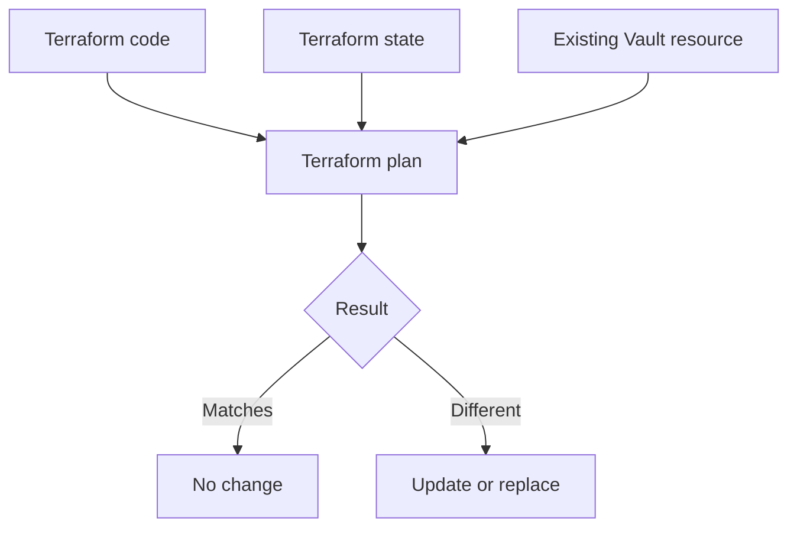

# Workshop 2: Import, Moved Blocks, Workspaces, and State

<!-- markdownlint-disable MD013 MD024 MD025 -->

[Back to the workshop landing page](./README.md)

**Live delivery:** Use the
[Workshop 2 presenter script](./presenter-script.md#workshop-2-import-moved-blocks-workspaces-and-state).
The detailed sections below are your technical reference.

## Workshop 2 timeline

| Time | Block | Topics |
| --- | --- | --- |
| 0:00-0:55 | Adopt existing resources | Import IDs, CLI import, import blocks, generated configuration, data sources, and first-plan review |
| 0:55-1:05 | Break | 10-minute break |
| 1:05-2:00 | Refactor and isolate safely | Moved blocks, module refactoring, projects, workspaces, state, permissions, and blast radius |

## Workshop 2 goal

### Notes!

> Today we will work with a Vault resource that already exists.
>
> We will import it into Terraform state, review the first plan, and discuss how
> to move resources into modules without recreating them.
>
> We will also discuss workspace and state boundaries. We do not want all Vault
> resources placed in one large state file.

## Part 1: Definition

### Import

### Notes!

> Import connects an existing real object to a Terraform resource address in
> state.
>
> Import does not move the real object. It does not recreate it. It does not
> automatically create perfect Terraform code.

### Resource address and import ID

### Notes!

> The resource address is the name Terraform uses in configuration and state.
> An example is `vault_mount.legacy`.
>
> The import ID identifies the real object. An example is the Vault mount path
> `legacy-kv`.
>
> The provider documentation tells us the correct import ID for each resource.
> Not every Terraform resource supports import.

### First plan after import

### Notes!

> After import, Terraform compares three things: our code, the state mapping,
> and the real Vault resource.
>
> The first plan may show no change, an update, or a replacement. Import does
> not guarantee a clean plan.
>
> If the plan shows an unexpected change, we stop. We fix the configuration
> before apply.



### Data source

### Notes!

> A data source reads an existing object. It does not import the object and does
> not give Terraform ownership of it.
>
> We use a data source when we need information. We use import when Terraform
> must manage the object's lifecycle.

### Moved block

### Notes!

> A moved block changes the Terraform address of a managed resource.
>
> We use it when we move a resource into a module or rename its Terraform
> address. A correct moved block does not recreate the real object.

### Workspace and state

### Notes!

> An HCP Terraform workspace is an execution and state boundary.
>
> A workspace is not only a folder. It has its own runs, state, variables,
> permissions, and settings.
>
> An HCP Terraform project groups related workspaces and helps us manage access
> to those workspaces.
>
> We separate workspaces based on ownership, environment, access, lifecycle,
> dependencies, and blast radius.
>
> We should not put every shared resource and all 60 or more team namespaces in
> one state file. One mistake could affect too many resources.

## Part 2: Trainer hands-on walkthrough

## Step 1: Start the local Vault server

### On screen

Start Vault by following the Podman or Docker option in
[pre-reqs.md](./pre-reqs.md).

Then run:

```bash
export VAULT_ADDR=http://127.0.0.1:8200
export VAULT_TOKEN=training-root
vault status
```

### Notes!

> This is a new disposable Vault server for Workshop 2. It is initialized,
> unsealed, and running only on my local machine.

## Step 2: Create an unmanaged Vault mount

### Notes!

> First, I will create a Vault secrets engine outside Terraform. This represents
> an existing Vault resource that was created by a script or manual command.

### On screen

```bash
vault secrets enable -path=legacy-kv kv-v2
vault secrets list
```

### Notes!

> The `legacy-kv` mount exists in Vault. Terraform does not know about it yet
> because it is not in Terraform state.

## Step 3: Create the import folder

### On screen

```bash
mkdir vault-import-training
cd vault-import-training
```

Create `main.tf`:

```hcl
terraform {
  required_version = ">= 1.5.0"

  required_providers {
    vault = {
      source  = "hashicorp/vault"
      version = "~> 5.0"
    }
  }
}

provider "vault" {}

resource "vault_mount" "legacy" {
  path        = "legacy-kv"
  type        = "kv"
  description = "Imported legacy KV mount"

  options = {
    version = "2"
  }
}
```

### Notes!

> This resource block describes how Terraform should manage the existing
> `legacy-kv` mount.
>
> I will not run apply yet. If I run apply before import, Terraform will try to
> create a resource at a path that already exists.

## Step 4: Run the CLI import

### On screen

```bash
terraform init
terraform import vault_mount.legacy legacy-kv
```

### Notes!

> `vault_mount.legacy` is the Terraform resource address.
>
> `legacy-kv` is the ID of the existing Vault mount.
>
> Terraform has now connected the resource address to the real mount in state.
> It did not create a second Vault mount.

### On screen

```bash
terraform state list
terraform state show vault_mount.legacy
terraform plan
```

### Notes!

> The state now contains `vault_mount.legacy`.
>
> The first plan compares our code with the existing mount. It may show a
> difference because our code includes a description that the existing mount
> may not have.
>
> We do not apply until we understand every difference.

## Step 5: Show the import block method

### Notes!

> The CLI import changes state immediately. Terraform also has a declarative
> import block.
>
> The import block can be stored in Git, reviewed in a pull request, and shown
> in a Terraform plan. This fits the target GitOps workflow better.

### On screen

```hcl
import {
  to = vault_mount.legacy
  id = "legacy-kv"
}
```

### Notes!

> `to` is the Terraform resource address. `id` is the existing Vault object ID.
>
> In a clean state, we would run plan and apply to complete this import.
>
> We will not add this block to the same state after already completing the CLI
> import. These are two different ways to perform the same mapping.

### On screen

Show the commands without running them in the existing CLI-import state:

```bash
terraform plan
terraform apply
```

## Step 6: Show generated configuration

### Notes!

> Terraform can generate starting configuration for supported resources.
>
> This can reduce manual work, but the generated code is not automatically
> production-ready. We still review it and remove incorrect or unnecessary
> values.

### On screen

Show this as a separate clean-state example. Do not add it to the state where
`legacy-kv` is already imported:

```hcl
import {
  to = vault_mount.generated
  id = "legacy-kv"
}
```

### On screen

```bash
terraform plan -generate-config-out=generated.tf
```

### Notes!

> This command needs an import block with no matching resource block. Terraform
> reads the existing object and writes starting resource configuration into
> `generated.tf`.

## Step 7: Show a data source

### Notes!

> This example reads existing Vault namespace information. It does not import
> the namespaces and does not make Terraform their owner.

### On screen

Do not run this against the local Community Vault server. Show it as an
Enterprise example:

```hcl
data "vault_namespaces" "existing" {
  namespace = ""
  recursive = true
}
```

## Step 8: Move the imported resource into a module

### Notes!

> Our imported resource currently has the address `vault_mount.legacy`.
>
> If we move it into a module, its address changes. The moved
> block tells Terraform that the old address and the new address represent the
> same real Vault object.

### On screen

Create the module folder:

```bash
mkdir -p modules/legacy-mount
```

Create `modules/legacy-mount/main.tf`:

```hcl
terraform {
  required_providers {
    vault = {
      source = "hashicorp/vault"
    }
  }
}

variable "mount_path" {
  type = string
}

resource "vault_mount" "this" {
  path        = var.mount_path
  type        = "kv"
  description = "Imported legacy KV mount"

  options = {
    version = "2"
  }
}
```

In root `main.tf`, remove the old `resource "vault_mount" "legacy"` block.
Replace it with:

```hcl
module "legacy_mount" {
  source = "./modules/legacy-mount"

  mount_path = "legacy-kv"
}

moved {
  from = vault_mount.legacy
  to   = module.legacy_mount.vault_mount.this
}
```

Run:

```bash
terraform init
terraform plan
```

### Notes!

> The destination resource now exists inside `module.legacy_mount`.
>
> The plan should show that `vault_mount.legacy` moved to
> `module.legacy_mount.vault_mount.this`. It should not delete and recreate the
> real Vault mount.
>
> If Terraform proposes deletion or replacement, we stop. The configuration is
> not ready.

## Step 9: Show the workspace design

### On screen

| Workspace | What it manages |
| --- | --- |
| Vault shared platform | Shared root or organization-level resources |
| Vault development | Development team resources |
| Vault production | Production team resources |
| Governance | Shared Terraform policies, if ownership is separate |

### Notes!

> This is a starting point, not a final workspace list.
>
> Shared resources need restricted ownership. Development and production need
> separate state and approval boundaries.
>
> We will decide how to group team namespaces by looking at their owners,
> lifecycle, dependencies, access, and blast radius.
>
> We will not import all namespaces into one large state file.

## Part 3: Attendee hands-on practice

## Practice 1: Import another Vault mount

### Notes!

> You will now create and import a second training mount named `practice-kv`.
>
> After import, run a plan and describe every proposed change. Do not apply an
> unexpected change.

### On screen

Create the unmanaged mount:

```bash
vault secrets enable -path=practice-kv kv-v2
```

Add this resource block:

```hcl
resource "vault_mount" "practice" {
  path = "practice-kv"
  type = "kv"

  options = {
    version = "2"
  }
}
```

Run:

```bash
terraform import vault_mount.practice practice-kv
terraform state show vault_mount.practice
terraform plan
```

### Correct result

- `vault_mount.practice` appears in state.
- Terraform does not create a second `practice-kv` mount.
- The attendee reads the first plan before applying anything.

## Practice 2: Choose workspace boundaries

### Notes!

> Place each item into a reasonable workspace: shared Vault configuration,
> development team configuration, production team configuration, Terraform
> governance policies, and existing team namespaces.
>
> There is not one correct number of workspaces. Your answer must protect access
> and reduce blast radius.

### Correct answer

- Shared configuration goes into a restricted shared workspace.
- Development and production use separate workspaces and state.
- Governance can use separate ownership.
- Existing namespaces are grouped by ownership and lifecycle.
- All namespaces are not automatically placed into one state.

## Part 4: Quiz

### Notes!

> We will finish with five short questions. Choose the best answer.

1. What does import do?
   - A. Recreates the resource
   - B. Connects an existing resource to Terraform state
   - C. Creates a Git branch
   - D. Approves a run
2. What must exist after import?
   - A. Matching Terraform resource configuration
   - B. Only a data source
   - C. A password in Git
   - D. A production token
3. What should you do if the first plan shows an unexpected replacement?
   - A. Apply it
   - B. Delete state
   - C. Stop and fix the configuration
   - D. Ignore it
4. What does a moved block change?
   - A. The Terraform resource address
   - B. The Vault token
   - C. The Vault server version
   - D. The Git repository
5. Why separate development and production state?
   - A. To separate access, approvals, and blast radius
   - B. To avoid modules
   - C. To remove peer review
   - D. To store secrets

### Answer key

1. B
2. A
3. C
4. A
5. A

## Workshop 2 closing notes

### Notes!

> Today we connected existing Vault resources to Terraform state. We reviewed
> the CLI import method, the import block, generated configuration, data
> sources, moved blocks, and workspace boundaries.
>
> The main safety rule is simple. Import first, review the plan, and stop if the
> plan shows an unexpected change.
>
> In the next workshop, we will connect this code to GitHub, Jenkins, HCP
> Terraform, secure Vault authentication, approvals, and drift detection.

### On screen after the workshop

Remove only the disposable local lab resources:

```bash
terraform destroy
```

Stop the Vault container by following the cleanup command for your selected
runtime in [pre-reqs.md](./pre-reqs.md).

## Navigation

- Previous: [Workshop 1: Terraform Foundations and Vault Enterprise Codification](./workshop-1.md)
- Next: [Workshop 3: GitHub, Jenkins, HCP Terraform, Security, and Drift](./workshop-3.md)
